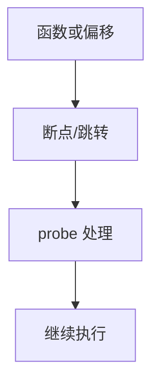

# kprobes 与 uprobes

kprobe 在内核指令处插入断点或跳转；uprobe 对用户 inode 的偏移做同样的事，无需重编目标。

<footer>—— 据 Linux kprobes 文档；uprobe 说明；[ftrace](/cs/ftrace-tracepoints) 为静态点对照</footer>

[tracepoint](/cs/ftrace-tracepoints) 要预先埋点。缺口是 **动态探针**：kprobe/uprobe，以及与调试器 INT3 的关系。

## 问题

kprobe：改指令为 int3/jmp，处理函数读寄存器。优化 kprobe 用跳转减断点税。uprobe：文件页写时拷贝打点，所有映射该文件的进程可见。缺口：与 [KPTI](/cs/kpti-os)/CFI 的摩擦；并发修改指令。本课不写如何做恶意挂钩。

kretprobe 在返回处。对象是观测，不是热补丁全文——livepatch 后课。

## 方法

注册地址 → 停机或用 text_poke 改代码 → 命中进处理。对照 [ptrace](/cs/syscall-trace)：ptrace 停整个线程；probe 可只采样。对照 [FUSE](/cs/fuse)：无关。对照 XDP：一个改包路径，一个改任意函数。

## 机制

动态探针让未埋点的函数也可观测，是现场调试的核心。税与风险高于 tracepoint。不要写成病毒。与 [hardening](/cs/kernel-hardening)：严格 CFI 下插入更难。

错误地址会 oops——要校验符号。

实现上：优化 kprobe 用跳转替代 int3，和 Ftrace 调用约定绑定。uprobe 在共享库上对所有进程生效，开销按进程数放大。指令替换必须停机或用 text_poke 同步。 读法上只引用[上一课](/cs/ftrace-tracepoints)的结论，不把对象换成训练推理或限价簿。

本课在操作系统进阶的「安全、启动与调试 / 观测与调试」课序里，对象是 **kprobes 与 uprobes**。

- 先修只引用，不重导：上一课的结论当公理，本课只补差。
- 五栏不吞并：不把本课写成大模型训练/推理，也不写成限价簿或权重量化。
- 文献用 OSTEP、McKusick、内核文档与具名会议论文；不发明 arXiv 编号。

## 边界

本课不引入所有 arch 的指令替换。不保证 JIT 用户代码的 uprobe。下一课基于采样：perf。

版本字段会变，课序钉的是机制对象「kprobes 与 uprobes」，不是某一主线内核的结构体名。
后课默认：可在运行时对 k/u 指令打点。PMU 采样与 perf，下一课。

## 小结

- kprobe 打内核，uprobe 打用户文件偏移。
- 比 tracepoint 灵活、更贵、更危险。
- perf 采样是下一课。
- 出处：Linux kprobes/uprobes；ftrace。
