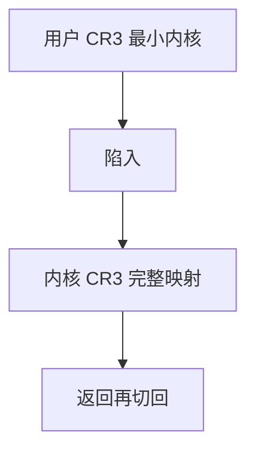

# KPTI 在 OS

KPTI 给用户运行一套几乎不含内核的页表，陷入再切回完整内核页表，使 Meltdown 一类通过缓存推测读内核的路径变难。

<footer>—— 据 Linux KPTI 文档；Lipp et al., Meltdown；Corbet 对页表隔离的 LWN 整理</footer>

[直接映射](/cs/direct-map-highmem) 让内核页框在内核页表里可走。[用户/内核分裂](/cs/user-kernel-split) 靠用户位，但推测执行可绕过。缺口是 **KPTI（页表隔离）** 在 OS 的代价：CR3 切换与 trampoline。

## 问题

Meltdown：用户推测加载内核直映地址，把秘密抽进缓存。缓解：用户 CR3 指向不含内核直映的表（仅少量入口trampoline）。系统调用/中断：切到内核 CR3。缺口：PCID 减少 TLB 全刷；无 PCID 则每次陷入射 TLB，syscall 变贵。本课不把 Spectre 各变体的微码写成清单。

nopti 可关。有硬件 Meltdown 免疫的 CPU 内核会自动弱化隔离。对象是页表根，不是 LSM。

## 方法

fork/exec：为进程准备两套 pgd 或切换视图。进入内核：trampoline 栈 + 切 CR3。对照 [RSS](/cs/rss-multiqueue)：性能税在陷入路径。对照 vmalloc：内核页仍在内核表里。对照 [NAPI](/cs/napi)：中断也要切表。

## 机制

KPTI 用页表切换换推测执行隔离，把 Meltdown 从「必中」变成「用户页表里没有那地址」。税是 TLB 与 CR3。不要写成密码学。与 [cgroup](/cs/cgroups) 无关。后课加固还会加更多：SMEP、KASLR。

调试：kprobes 在隔离下仍要能跑，入口路径变复杂。

实现上：PCID 让两套 pgd 的 TLB 项共存，否则每次 syscall 射 TLB。trampoline 栈避免用用户 RSP 进核。硬件免疫 Meltdown 的 CPU 可编译或运行时弱化 KPTI。 读法上只引用[上一课](/cs/direct-map-highmem)的结论，不把对象换成训练推理或限价簿。

本课在操作系统进阶的「内存进阶 / 回收、迁移与加固」课序里，对象是 **KPTI 在 OS**。

- 先修只引用，不重导：上一课的结论当公理，本课只补差。
- 五栏不吞并：不把本课写成大模型训练/推理，也不写成限价簿或权重量化。
- 文献用 OSTEP、McKusick、内核文档与具名会议论文；不发明 arXiv 编号。

## 边界

本课不引入 L1TF 的全部 KVM 特例——虚拟化后课会再遇。不保证 32 位 pae 的同一实现。下一课把若干加固开关收成一课：内核加固。

版本字段会变，课序钉的是机制对象「KPTI 在 OS」，不是某一主线内核的结构体名。
后课默认：用户运行时可不见内核直映。更多加固原语（SMEP/SMAP/CFI 等），下一课。

## 小结

- KPTI 用双页表减少用户推测读内核。
- 陷入切 CR3，PCID 减 TLB 税。
- 内核加固是下一课。
- 出处：Linux KPTI；Meltdown 论文；LWN。
