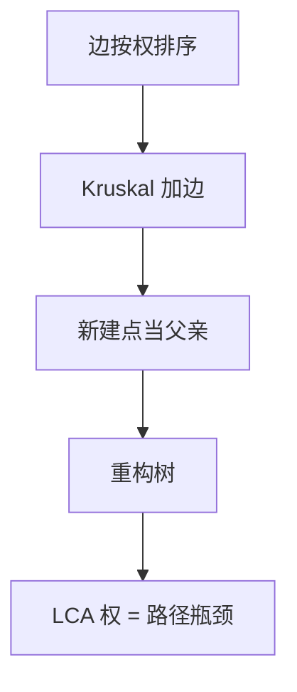

# Kruskal 重构树

按边权从小到大做 Kruskal，每次连通两棵树就新建一个点当父亲、权记在该点上；原图路径的最大边，变成重构树上 LCA 的权。

<footer>—— 据 Kruskal, 1956 的加边过程；重构树为 MST 上的标准派生结构整理</footer>

上一课[点分治](/cs/centroid-decomposition)按重心切树。主干[Kruskal 与 Prim](/cs/mst-kruskal-prim)已用并查集按权加边。缺口是把加边历史**树化**：Kruskal 重构树。查询「$u$ 到 $v$ 路径上的最大边权」（瓶颈路）变成 LCA，不再每次从原图走。不重证切分定理。

## 问题

无向图，路径瓶颈 = 路径上最大边的最小可能（所有路径取 min-max）。最小生成树上的 $u$–$v$ 路径即给出该瓶颈（唯一性不必：MST 路径是一组瓶颈最优）。重构：叶子是原顶点。边权升序，若两端不连通，新建节点 $p$，权为该边权，`parent[find(u)]=parent[find(v)]=p`。最终一棵二叉树形（森林）的有根树，内部点对应 MST 边。

$lca(u,v)$ 的权 = $u$–$v$ 的瓶颈。子树 = 「只用不大于该权的边能连通的点集」。缺口是这张树，不是再跑 Kruskal 求整棵 MST 权。

### 不是 steiner 树

内部点是虚拟的，不在原图。深度可按加入顺序，单调。查询连通性：两点在权 $\le x$ 下连通 $\Leftrightarrow$ LCA 权 $\le x$，或把权当深度做倍增。

结构随 Kruskal 过程自然出现，无单独必引论文时引 Kruskal 1956 与并查集。最大生成树把权取负，瓶颈改成路径最小边。后课 Borůvka 与次小生成树仍在 MST 家族，不走重构查询。

## 方法

边排序；并查集维护当前树根。新建 $O(n)$ 个内部点。对重构树做 LCA / 倍增。注意并查集的 `find` 要连到当前真实树根（虚拟点）。

不连通则森林，跨树询问无路径。

## 机制

Kruskal 加入的边是当时连接两连通块的最轻边，故该边权等于两块之间的瓶颈。LCA 正是合并 $u$、$v$ 所在块的那一次，权即瓶颈。与点分治不同：这里树的形状由边权决定，用来回答与权阈值相关的连通，不是任意距离计数。

 Prim 的生长序一般不直接给出同一 LCA 语义，本课用 Kruskal。

## 边界

本课不写次小生成树（下一课）、不写有向最小树形图。动态边权要用 LCT 维护 MST，重构树静态。后课默认：瓶颈路 = MST 路径 = 重构树 LCA。下一课 Borůvka 并行长树，以及次小生成树。

## 小结

- Kruskal 加边史变成有根树；LCA 权是瓶颈。
- 阈值连通 = 内部点权比较。
- 静态无向图；与重心分治分工不同。
- 出处：Kruskal, 1956；并查集见 CLRS 第 21 章。
