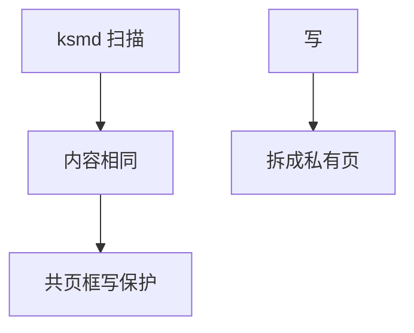

# KSM

KSM 扫描已标记的匿名页，把内容相同的页合并成一页并写保护；再写则 COW 拆开。

<footer>—— 据 Linux Kernel Samepage Merging 文档；Waldspurger 对 ESX 页共享的背景</footer>

[THP](/cs/thp) 合并的是连续对齐页。[fork](/cs/fork) 的 COW 只共享血统相同的页。虚拟机里许多页碰巧内容相同（全零、相同 libc）。缺口是 **KSM**：按内容合并。

## 问题

`madvise(MADV_MERGEABLE)` 或 qemu 默认把客户机 RAM 标可合并。ksmd：校验和分桶，memcmp，合并后一页框、多 pte，[rmap](/cs/rmap) 变长。缺口：CPU 扫描税；侧信道（合页证明内容相同）；与 NUMA（合并到哪一节点）。本课不把 KVM 气球提前写完。

全零页可走 zero page，不必 KSM。稳定树与不稳定树是实现分法。教学对象是「内容相等 ⇒ 可共享直到写」。

## 方法

扫描 → 哈希 → 比较 → 若等则把一页映射到另一页框，释放源，pte 写保护。写故障：分配新页拷开。对照 FS [快照](/cs/fs-snapshots)：共享未改块；KSM 无「数据集根」，是全局扫描。对照 [overlay](/cs/overlayfs)：一个文件树层，一个页内容。

## 机制

KSM 用 CPU 换 DRAM，适合同质 VM 密度。它改变「匿名页私有」的默认，引入信息泄漏面。不要写成去重存储产品。与 THP：大页内容更难吃进合并，常先拆再扫。

关闭 KSM 是安全/延迟场景的合理默认。

实现上：扫描速率用 pages_to_scan 调，太快伤延迟，太慢省不了内存。合并跨 NUMA 会把访问变成远程。关闭 merge 不会立刻拆页，已合并页要等写或换出。 读法上只引用[上一课](/cs/thp)的结论，不把对象换成训练推理或限价簿。

本课在操作系统进阶的「内存进阶 / 回收、迁移与加固」课序里，对象是 **KSM**。

- 先修只引用，不重导：上一课的结论当公理，本课只补差。
- 五栏不吞并：不把本课写成大模型训练/推理，也不写成限价簿或权重量化。
- 文献用 OSTEP、McKusick、内核文档与具名会议论文；不发明 arXiv 编号。

## 边界

本课不引入 KSM Advisor 的全部自动调参。不保证跨 memcg 合并的记账细节在每版本一致。下一课内存紧张时的压缩缓存：zswap。

版本字段会变，课序钉的是机制对象「KSM」，不是某一主线内核的结构体名。
后课默认：相同匿名页可被扫成共享。换出前压缩进内存池，下一课 zswap。

## 小结

- KSM 按内容合并匿名页，写则 COW。
- 省内存、耗 CPU、有侧信道。
- zswap 是下一课。
- 出处：Linux KSM；Waldspurger ESX；Gorman。
