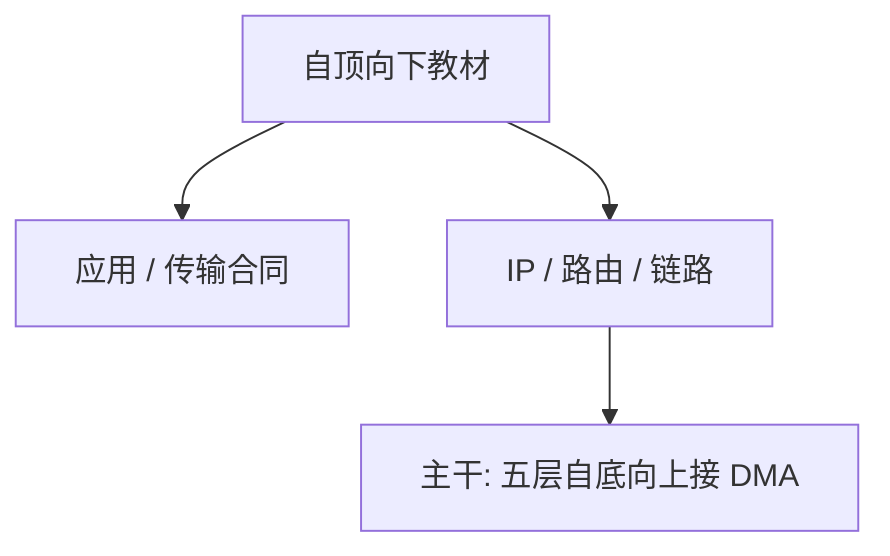

# Kurose / Ross 网络

自顶向下：先应用与传输合同，再下到 IP 与链路；五层是教学地图，协议细节以 RFC 与实现为准。

<footer>—— Kurose and Ross, Computer Networking: A Top-Down Approach</footer>

[上一课](/cs/riscv-priv-spec)附录对照了 RISC-V 特权手册。附录对照，不插入主干。本栏附录到此结束。主干已在[分层与端到端](/cs/layering-e2e)到[套接字](/cs/socket-api)按五层走过网络；这里对照 **这本教材的问题**：如何把互联网协议收成可教的一本，并用自顶向下挡住「先背满以太网再谈 HTTP」。不重做握手与 BGP 政策。

## 问题

特权手册给主机内部契约。Kurose/Ross 的缺口是主机之间：套接字应用看到什么，TCP/UDP 保证什么，IP 如何转发，链路如何成帧。主干课序其实是自底向上接 OS 的 DMA，与教材目录相反——这正是对照的意义：教材可以从 HTTP 讲起，本栏必须先有帧，因为上一门课是 virtio 与 DMA。RFC 791/793/8200 在主干当真实编号使用，教材是地图不是标准文本。

Tanenbaum *Computer Networks* 是另一本对照。本栏网络课多次点名 Kurose and Ross，与 MOS 那本 OS 教材分工：一个协议栈，一个内核子系统。

## 方法

教材分应用、传输、网络、链路，加无线与多媒体等章。主干把 CDN、任播、拥塞算法拆进课序叶子，不把某年版的「历史上的 HTTP」插进主干。附录对照方法：顶层合同先讲清，再允许读者往下看实现。

## 机制

教材把 Saltzer 端到端、Cerf–Kahn 互联、RFC 字节流收成习题与抓包直觉。主干已经按树上课；读这本书不能替代从帧读到套接字。安全课的 TLS 在教材里常单章，本栏放在安全主干用 RFC 8446。

### 为何对照而不插入主干

若把 Kurose/Ross 插在特权手册之后当「必读下一课」，课序会变成另一本教材目录，并且与已上完的网络课重复。附录只对照地图与自顶向下立场。主干封口仍是[计算栈到此为止](/cs/to-systems-boundary)。

## 边界

不要把课后编程作业当本栏叶子。也不要在附录里开 SDN 控制器型号审计。计算机栏主干已封口；本附录结束文献序列，不把读者送回比特课，只送回那张协议地图。

对照结束应回到主干网络各课与[计算栈到此为止](/cs/to-systems-boundary)。文献序列在此终止。

## 小结

- 附录对照 Kurose and Ross：自顶向下的互联网教材地图。
- 主干网络课已按五层取用；RFC 791/793/8200/8446 是标准，教材是地图。
- 文献对照序列在此结束；主干封口仍是 to-systems-boundary。
- 出处：Kurose and Ross, *Computer Networking*。
