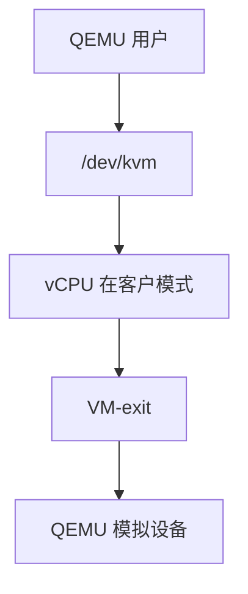

# KVM 与 QEMU 分工

KVM 在内核提供 vCPU 与内存槽、处理 VM-exit；QEMU 在用户态模拟设备、启动固件、把 tap 接到 [网桥](/cs/bridge-tun-tap)。

<footer>—— 据 Linux KVM 文档；QEMU 对 KVM 加速的说明；[ioctl](/cs/chardev-ioctl) 为 /dev/kvm 先修</footer>

[类型](/cs/hypervisor-types) 把 Linux 放在中间。缺口是 **分工**：谁跑客户指令，谁模拟 virtio-blk。

## 问题

`/dev/kvm` ioctl：建 VM、设内存、跑 vCPU。exit 原因：MMIO、PIO、halt。QEMU：注册内存区、模拟 PCI、调用 KVM_RUN。缺口：ioeventfd/irqfd 减退出；与 [cgroup](/cs/memcg) 限制 QEMU 进程。本课不把每条 ioctl 列出。

Firecracker 后课用同一 KVM、更瘦设备模型。对象是加速器与模拟器切分。

## 方法

QEMU mmap 客户 RAM → KVM 设 slot → 循环 KVM_RUN → exit 则模拟设备再进。对照 [FUSE](/cs/fuse)：用户完成内核发起的请求。对照 [uffd](/cs/userfaultfd)：postcopy 迁移。对照 NVMe：virtio 是半虚拟，后课。

## 机制

分工让内核保持小：不管 VGA 字体，只管进入客户与页表。用户态崩不等于宿主要 oops（通常）。不要写成 virt-manager 教程。与 [seccomp]：可锁 QEMU。与 [audit](/cs/kernel-audit)：ioctl 可记。

性能：exit 率决定上限，后课直通。

实现上：ioeventfd 让设备 kick 不进 QEMU 用户循环。vCPU 线程是普通 Linux 任务，可被 cgroup 限。guest RAM 是 QEMU 的 mmap，KVM slot 指向它。 读法上只引用[上一课](/cs/hypervisor-types)的结论，不把对象换成训练推理或限价簿。

本课在操作系统进阶的「虚拟化与隔离进阶 / Hypervisor」课序里，对象是 **KVM 与 QEMU 分工**。

- 先修只引用，不重导：上一课的结论当公理，本课只补差。
- 五栏不吞并：不把本课写成大模型训练/推理，也不写成限价簿或权重量化。
- 文献用 OSTEP、McKusick、内核文档与具名会议论文；不发明 arXiv 编号。

## 边界

本课不引入所有 machine type。不保证 Windows Hyper-V 的对等分工。下一课硬件陷入：VMX VM-exit。

版本字段会变，课序钉的是机制对象「KVM 与 QEMU 分工」，不是某一主线内核的结构体名。
后课默认：KVM 跑 vCPU，QEMU 做设备。VMX 与退出原因，下一课。

## 小结

- KVM：vCPU/内存/exit；QEMU：设备与生命周期。
- 经 ioctl 与事件 fd 协作。
- VMX/VM-exit 是下一课。
- 出处：KVM API；QEMU；Linux virt。
