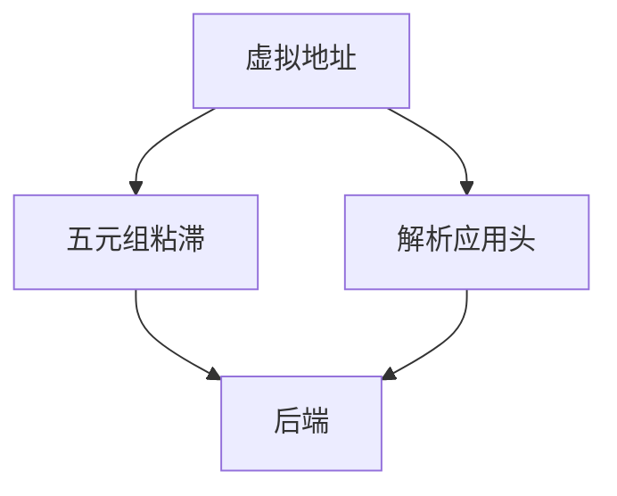

# L4 / L7 负载均衡

L4 按五元组把连接钉到后端；L7 终止协议、看 Host/路径/Cookie 再选。能力与代价一层一层上去。

<footer>—— 据 RFC 9110；负载均衡实践；Maglev 课将细化一致性哈希整理</footer>

[ECMP](/cs/ecmp-hashing) 在路由器。[上一课](/cs/edge-compute) 要把请求分到实例。缺口是 **LB 分层**：L4 vs L7、粘滞、健康检查。本课不把 Maglev 算法写完。

## 问题

多后端提供同一服务。L4（NAT 或 DR）：不看 HTTP，快，SSL 可直达后端。L7：能按 URL 分流、重试幂等 GET、塞头，但要证书与缓冲，HOL/流控在 LB 上。WS 升级、gRPC、H3 都要求 L7 懂协议。健康检查失败应摘除，否则 GeoDNS 再准也打到死进程。

不要把 DNS 轮询当健康检查。

DSR/NAT 模式是实现。本课钉层。VIP 是前端地址。

### 层决定看见什么

L4 粘五元组；L7 看 Host 与路径。健康检查必要。H3/gRPC/WS 逼 L7 懂协议。DNS 轮询不是健康检查。

## 方法

对照 L4/L7 能力表。画：VIP → 选择 → 后端。与 WFQ：LB 选服务器，WFQ 分带宽。

方法止于选定对象与对照；机制才说它如何嵌入已有分层与主干课。

## 机制

连接迁移：L4 钉四元组，QUIC 迁移要 CID 感知（下一课 Maglev 相关）。PFC 与 LB 无关。SYN flood 打在 L4 VIP 上，cookies 可在 LB。度量：最少连接 vs 轮询，极化类似 ECMP 大象。

安全：L7 可 WAF，扩大攻击面也扩大防护点。

## 边界

本课不引入服务网格 sidecar 的全部。Maglev 是下一课。后课默认：L4 保连接；L7 看内容；健康检查必要。

把有状态会话只放一台且无粘滞，用户会随机丢登录。

上一课留下的缺口在本课收口；「L4 / L7 负载均衡」进入后课词汇表后只引用。文献用来钉对象与边界，不把本课写成该主题的独立综述。下一课[Maglev](/cs/maglev-lb)。

## 小结

- L4 快、协议不可见；L7 智、要终止。
- 粘滞与健康检查决定正确性。
- 新运输（H3/gRPC）逼 L7 升级。
- 后课只引用本课钉死的对象，不从该领域总问题重开。
- 出处：HTTP 语义；LB 实践。
