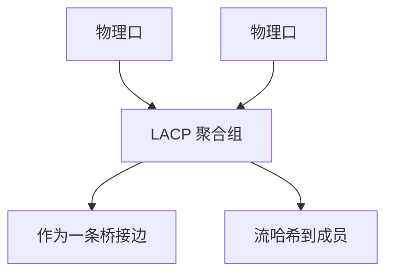

# LACP

多条物理链路绑成一条逻辑链路，既要防环又要分摊流量；LACP 用协议确认对端也同意捆绑，避免单边聚合把环藏起来。

<footer>—— 据 IEEE 802.1AX（原 802.3ad）Link Aggregation 整理</footer>

[上一课](/cs/jumbo-mtu)要求路径 MTU 一致。多口并联若只在一边静态捆绑，另一边仍当独立口，[生成树](/cs/spanning-tree) 与泛洪会错。缺口是 **LACP**：两端交换 LACPDU，形成聚合组，MAC 学习看到一个逻辑口。本课不把 LLDP TLV 写完。

## 问题

升速可以换更快 PHY，也可以 4×10G 当 40G 用。静态捆绑：配错则成环或黑洞。LACP：Actor/Partner 系统 ID、密钥、端口优先级，只有匹配的口进入 Collecting/Distributing。流量按哈希分到成员（后课 ECMP 是三层同类问题）。一条成员故障，逻辑链路降速不断。

不要把 PHY 多 lane（100GBASE-SR4）当成 LACP：lane 在模块内 deskew，LACP 在 MAC 之间。

802.1AX 把聚合从 802.3 抽出。模式 active/passive 决定谁先发 PDU。本课不把每家芯片的哈希多项式背完。

### 捆绑确认对端

静态单边聚合会藏环。逻辑口对 STP 是一条边；哈希保序不保大象流均衡。PHY 多 lane 不要叫 LACP。

## 方法

选举：系统优先级 → 口优先级 → 选活动成员。画：物理口 → LAG 逻辑口 → 桥接表。哈希键通常含 MAC/IP/端口，保证同流同成员，避免乱序。与 STP：LAG 是一条边，不会在成员之间形成二层环。

方法止于选定对象与对照；机制才说它如何嵌入已有分层与主干课。

## 机制

自协商仍按成员口独立完成；速率不一致通常不允许入组。PAUSE 可按成员，逻辑上仍应避免不对称暂停。巨帧必须全体成员一致。主干 CSMA 课的「交换」在此变成「交换 + 捆绑」。

控制面：LACPDU 走慢协议组播，不被数据哈希打乱。

## 边界

本课不引入 MLAG/vPC 跨机箱聚合的全部一致性协议。LLDP 是下一课。后课默认：捆绑成功当一条二层边；哈希保序不保完美均衡。

极化（elephant 流打满一条成员）是哈希的边界，要用更细的键或后课 ECMP 对照。

上一课留下的缺口在本课收口；「LACP」进入后课词汇表后只引用。文献用来钉对象与边界，不把本课写成该主题的独立综述。下一课[LLDP](/cs/lldp)。

## 小结

- LACP 确认对端后才转发，避免单边聚合。
- 逻辑口对 STP 与 MAC 表是一条边。
- 同流同成员，防乱序。
- 后课只引用本课钉死的对象，不从该领域总问题重开。
- 出处：IEEE 802.1AX。
