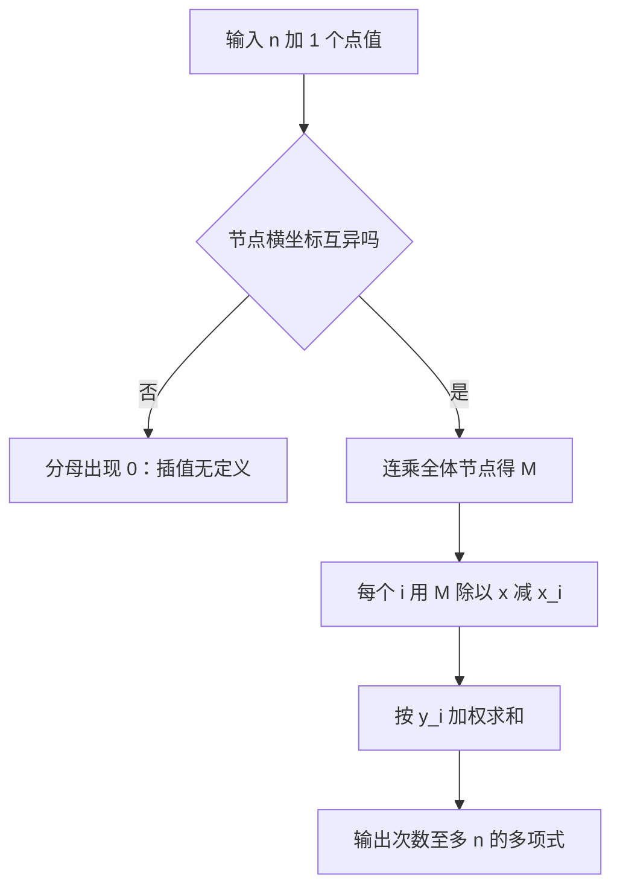
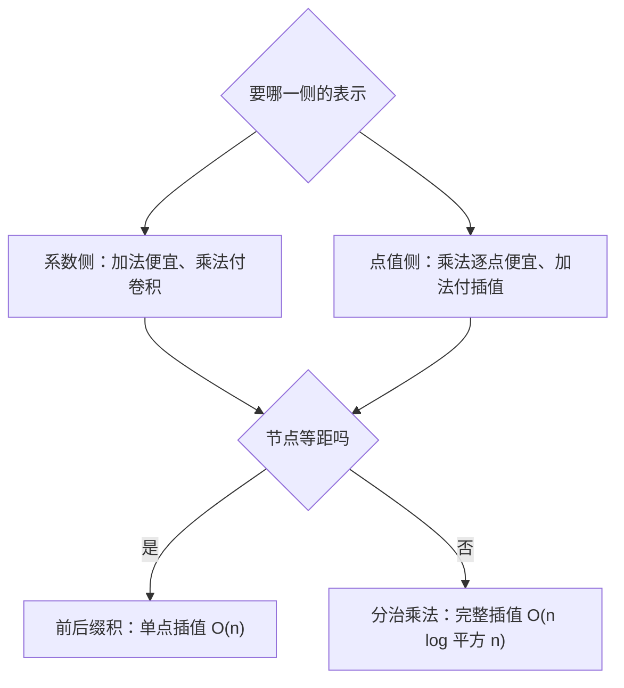

# lagrange-interpolation

过 $n+1$ 个横坐标互异的点，恰有一个次数至多 $n$ 的多项式——求值容易，插值回去也该有便宜的路。

<footer>—— J.-L. Lagrange, 1795 师范学校讲义；插值公式的经典出处</footer>

[上一课](/cs/matrix-tree-theorem)用行列式把「数树」压成一次消元；这一课做反向的事：把散落的点值升回系数。缺口是 **Lagrange 插值**：多项式的系数表示与点值表示一一对应，插值就是换一套坐标基。本课写朴素公式与 $O(n)$ 的前后缀变体，不写数值稳定性分析与样条。

## 问题

系数侧加法便宜、乘法要卷积；点值侧乘法逐点相乘、加法要插值——两套表示各持半张牌。竞赛里的典型缺口：$\sum_{i=0}^{n-1} i^k$ 这类在等距点上取值的量，本质是一个次数 $k+1$ 的多项式，取 $k+2$ 个点插回去就绕开了逐项求和。本课不写 [FFT](/cs/fft) 的推导，只认它「系数与点值互转」这个身份。

术语翻译：interpolation 插值 = 已知点值求系数；interpolation nodes 插值节点 = 那组横坐标 $x_i$；$n+1$ 个点确定的是次数至多 $n$ 的多项式，次数上界比点数少一。

## 方法

对每个 $i$ 造基函数 $L_i$：在 $x_i$ 处取 $1$、在其余节点取 $0$，答案即 $\sum_i y_i L_i(x)$。分子连乘 $\prod_{j\ne i}(x-x_j)$，分母除掉 $x_i-x_j$；要 $O(n)$ 求单点，先把全体节点连乘成 $M(x)=\prod_j(x-x_j)$，再逐项除掉一个一次式、乘上 $y_i$ 累加。

数字实例：过 $(0,0),(1,1),(2,4)$ 三点，答案是 $x^2$。取 $x=3$ 验基函数：$L_0(3)=\frac{2\cdot1}{(-1)(-2)}=1$，$L_1(3)=\frac{3\cdot2}{1\cdot(-1)}=-3$，$L_2(3)=\frac{3\cdot2}{2\cdot1}=3$；加权 $0\cdot1+1\cdot(-3)+4\cdot3=9=3^2$，三点钉死抛物线。

## 机制

唯一性是地基：若两个次数至多 $n$ 的多项式在 $n+1$ 个互异点上同值，其差有 $n+1$ 个根，而非零多项式根数不超过次数，故差恒为零。同一件事的另一面：插值是解 Vandermonde 线性方程组，Lagrange 公式只是把这个矩阵的逆写成了显式。节点取得「顺手」（等距、单位根）时变换便宜，任意节点则要付分治乘法的账。

直觉类比：系数与点值是同一支箭的两套坐标，像直角坐标与极坐标之于同一个向量。Lagrange 插值就是坐标变换矩阵的显式逆——[FFT](/cs/fft) 是等距节点下最快的摆渡船，任意节点时船票按 $O(n\log^2 n)$ 计价。

常见误区：以为节点必须等距或必须取 $0$ 到 $n$。互异即可——等距只是让分子分母的连乘有规律、前后缀积能 $O(n)$ 处理；硬把非等距点塞进前后缀套路会算出错误系数，错在假设了不存在的等差结构。

## 边界

数值域里插值怕病态节点（等距大节点下高次振荡），竞赛场景几乎都走模素数——逆元用费马小定理现取。$k$ 次多项式要 $k+1$ 个点，少一个点留自由度，多给的点拿来验证而不是硬塞。分治版插值能替代 Newton 形式的手工差商，但常数更大。与下一课的衔接在「对称」：等价类计数的去重缺口，由 Burnside 的平均不动点来补。

常见误区：把「$n+1$ 个点」读成「次数 $n+1$」。错在把点数当次数——$n+1$ 个互异点钉死的是次数**至多 $n$** 的多项式；要唯一确定次数恰为 $k$ 的多项式，给 $k+1$ 个点。差一个自由度，外推就飘。

## 小结

- $n+1$ 个互异点唯一确定次数至多 $n$ 的多项式，Lagrange 公式给出显式解。
- 单点插值 $O(n)$：整体连乘、逐项除一次式、按 $y_i$ 加权。
- 等距点是计数利器，$\sum i^k$ 这类求和直接插回去。
- 任意节点完整插值走分治，$O(n\log^2 n)$。
- 出处：J.-L. Lagrange, 1795；J. von zur Gathen 与 J. Gerhard, *Modern Computer Algebra*；cp-algorithms 的 Lagrange Interpolation 词条。
