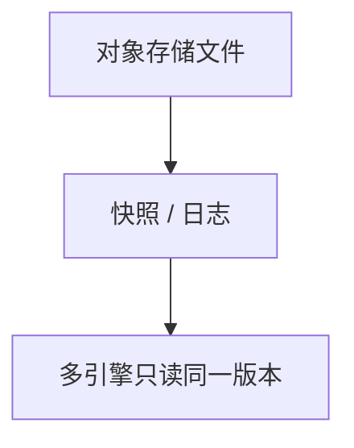

# 湖仓与开放表格式

对象存储上的 Parquet 不是表：没有事务、没有隔离、没有可靠的 schema 演进。表格式把数据湖补成可被引擎共享的关系。

<footer>—— 据 Armbrust et al. 对 lakehouse；Delta Lake / Apache Iceberg / Apache Hudi 的公开设计</footer>

[上一课](/cs/olap-cube)假定有一张可维护的事实表。缺口是文件堆：数仓一体机贵，HDFS 上的目录又没有 ACID。本课钉湖仓与开放表格式；MapReduce 下一课才讲批计算模型。不把对象存储当新的 B+ 树重讲。

## 问题

湖：廉价存储 + schema-on-read，丢了主键、并发写、时间旅行。仓：强事务，锁进专有格式。表格式（Iceberg/Delta/Hudi）在对象存储上加：快照隔离、分区演进、列投影、可重放的提交日志。缺口是**元数据如何成为真值**，不是再夸一次列存。

多引擎（Spark、Trino、Flink）共用同一快照，才叫开放。只给一个引擎写的「湖」仍是专有仓。

## 方法

读一次提交：manifest / transaction log 指向不可变文件。写：copy-on-write 或 merge-on-read。compaction 把小文件合并。与立方：物化视图可以挂在表快照上。与流：changelog 表是后课 exactly-once 的落点。

## 机制

不可变文件 + 原子换根指针 ≈ [影子分页](/cs/shadow-paging) 在对象存储上的亲戚，也像 LSM 切根。隔离来自「读一个快照 ID」，不是行锁；跨表 2PC 通常没有或很弱，不要当 Spanner。小文件问题来自列出与打开成本，compaction 合并——表级 LSM。delete file / merge-on-read 让读时合并删除位，读放大上升。

并发写：条件 put 或锁服务提交元数据，冲突则 abort 重试。时间旅行等于选旧快照。schema 演进写进元数据，读侧按字段投影，与 [模式迁移](/cs/schema-migration) 的文件版对齐。TDE 在对象存储侧，密钥合同单独写。

## 边界

本课不比较 Iceberg / Delta / Hudi 的每一条 SQL。下一课 MapReduce 是计算模型，不是表。不要把湖仓写成已经取代 OLTP：提交延迟与行锁粒度都不在同一档。流写入必须控制批次，否则小文件打爆元数据。

后课默认：分析表用开放格式快照；跨引擎共享的是文件集，不是缓冲池。

## 小结

- 表格式把对象存储补上快照与演进，才成为多引擎的表。
- 元数据日志是真值；数据文件只追加；compaction 管小文件。
- MapReduce 下一课。
- 出处：Armbrust 等 lakehouse；Iceberg / Delta / Hudi 设计文档。
