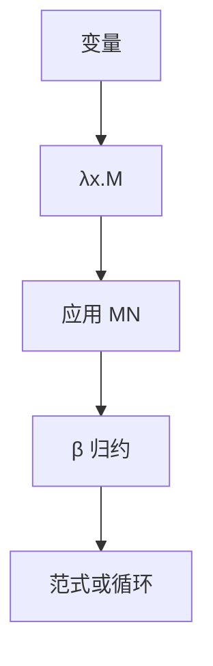

# λ 演算

项由变量、抽象 $\lambda x.M$ 与应用 $MN$ 建成；β 归约是计算。Church 用它定义可计算，与图灵机等价。

<footer>—— 据 Church, The Calculi of Lambda-Conversion, 1941；Barendregt, The Lambda Calculus 整理</footer>

上一课[Kolmogorov 复杂度](/cs/kolmogorov-complexity)的程序仍是 TM 带上的串。Church–Turing 论题点名过 λ，尚未展开。缺口是**无类型 λ 演算**：另一套计算的语法。本课钉项、自由变量、β、Church 数字；组合子与 $Y$ 下一课。

## 问题

TM 把状态与带混在表里，函数是事后编码。λ：一切都是项。$\lambda x.M$ 绑定，$MN$ 应用。$(\lambda x.M)N\to_\beta M[N/x]$（小心捕获）。规范化：有的项无范式（$\Omega=(\lambda x.xx)(\lambda x.xx)$），对应 TM 循环。可计算函数：Church 编码的 $\mathbb{N}\to\mathbb{N}$ 上有范式的项。

与 TM 等价：论题课已声明；本课不写互译。用处是后课组合子、以及逻辑课里的证明即项（那里要类型）。

### β 不是「代入语法糖」

捕获会把自由 $x$ 绑错，必须 α 换名。合流（Church–Rosser）：若有范式则唯一，计算路径可以不同。策略（正则序 / 应用序）影响会不会停，不改变范式（若存在）。

Church 1936/1941。Barendregt 是标准参考。无类型 λ 图灵完全；简单类型 λ 反而弱，不够当全部可计算，后课证明助手再加依值类型。

## 方法

写几个项：恒等 $I=\lambda x.x$，真假 $\mathrm{T}=\lambda xy.x$，$\mathrm{F}=\lambda xy.y$，数字 $\overline n=\lambda fx.f^n x$。加法、后继是项。强调：数据与函数同一语法。不要把 Python 的 `lambda` 当定义——那是有环境的闭包，归约策略由语言定。

[递归定理](/cs/recursion-theorem) 在 λ 里变成找 $F$ 的不动点项，下一课 $Y$。

## 机制

计算 = 改写，没有带与头。不可判定性平移：是否有范式不可判定，等于停机。本课不重做对角化。名字绑定是后课类型论的预演，本课只要求会画自由/约束。

不要在无类型 λ 里谈「类型错误」：每个项都可以应用。

Church 数字把迭代交给项：$\overline{m}\,\overline{n}$ 不是整数乘，要另写乘项。布尔、序对、列表都可以编码，故「数据」不是原语。无范式的项对应循环；正规序（先最左外约）对有范式的项保证找到范式，应用序可能先循环。实现语言选策略，理论先承认合流。

## 边界

本课不引入简单类型、Hindley–Milner、惰性求值实现。不写 Y 组合子的展开。后课默认：λ 项 + β 是可计算模型；数字用 Church 编码。下一课去掉名字：组合子与不动点。

## 小结

- λ 项：抽象与应用；计算是 β。
- 有范式对应停机；与 TM 等价已由论题对齐。
- 数据亦项；换名避免捕获。
- 出处：Church, 1941；Barendregt。
