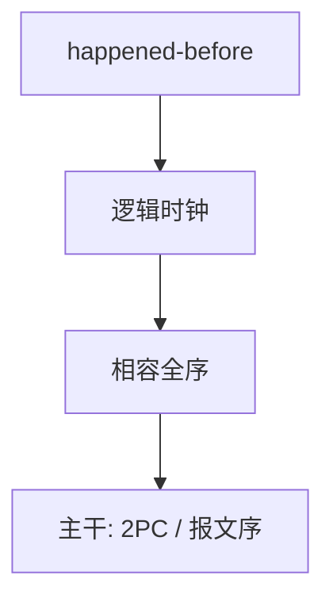
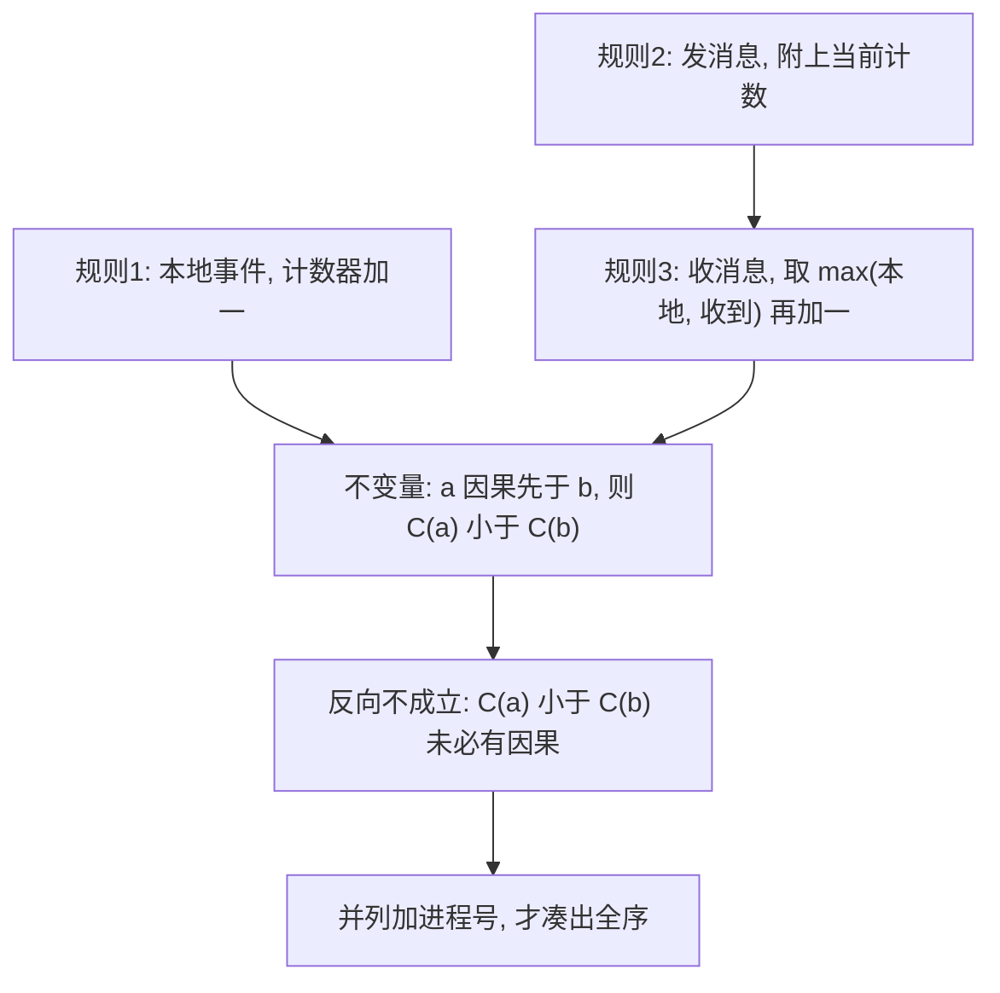

# Lamport 时钟

没有共享时钟时，「先发生」是消息上的偏序；逻辑时钟给每个事件一个数，使因果不颠倒。

<footer>—— Lamport, Time, Clocks, and the Ordering of Events in a Distributed System, CACM 1978</footer>

[上一课](/cs/dijkstra-the)附录对照了共享内存上的互斥。附录对照，不插入主干。主干网络课有报文与[TCP](/cs/tcp-handshake)，数据库有[两阶段提交](/cs/two-pc)，但没有把「分布式事件序」写成一课。这里对照 **1978 原文的问题**：空间上分开的进程，墙钟不可靠，如何定义因果并给状态机复制一个相容全序。不把 Paxos 插入主干。

## 问题

Dijkstra 的临界区假设共享变量可见。跨主机时，只有消息。墙钟 skew 会把因果说反。Lamport 的缺口是：happened-before 偏序，以及逻辑时钟 $C$ 满足 $a\to b\Rightarrow C(a)\lt C(b)$。全序广播用时钟加进程号打破并列。主干 2PC 用协调器日志给提交一个全序，是工程特例，不是 1978 文的全部。

逻辑时钟不度量秒。真实时间同步（NTP）是另一问题。向量时钟后来细化并发，1978 文用标量。

术语翻译：happened-before（先发生）说的不是钟表上的先后，而是「$a$ 影响到了 $b$」：同进程内 $a$ 先执行、$a$ 发的消息 $b$ 收到、或经传递链串起来——三者之一成立，才叫 $a\to b$。

## 方法

每进程递增计数器；发送时带上本地时；接收取 max 再加一。由此画事件图。状态机复制：按逻辑时序投递命令，得到相同状态——与数据库「等价串行序」同族，对象是消息而不是读写锁。

```mermaid
flowchart TD
  HB["happened-before"] --> LC["逻辑时钟"]
  LC --> TO["相容全序"]
  TO --> TRUNK["主干: 2PC / 报文序"]
```

## 机制

有了偏序，才能说「不是因果乱序」与「真正并发」。2PC 的阻塞窗口是故障模型下的原子，不是逻辑时钟的定理。本附录不把拜占庭、Raft 写进 1978。主干刻意不在网络课展开逻辑时钟，以免 TCP 课变成分布式系统课。

```mermaid
flowchart TD
  R1["规则1: 本地事件, 计数器加一"] --> G["不变量: a 因果先于 b, 则 C(a) 小于 C(b)"]
  R2["规则2: 发消息, 附上当前计数"] --> R3["规则3: 收消息, 取 max(本地, 收到) 再加一"]
  R3 --> G
  G --> BUT["反向不成立: C(a) 小于 C(b) 未必有因果"]
  BUT --> FIX["并列加进程号, 才凑出全序"]
```

数字实例：P1 计到 2 时发出消息；P2 本地才到 1，收到后取 $\max(1,2)+1=3$。此后 P2 的一切事件都大于 2——消息像把 P1 的时钟「接种」给了 P2，因果链因此永远不会被数字说反。

常见误区：初学者容易以为 Lamport 时钟能判断任意两事件「谁真的先发生」。标量时钟只保证因果不被颠倒；两个数比不出因果时，事件就是「可能并发」，要精确判并发得上向量时钟。

### 为何对照而不插入主干

若把 1978 插在 UDP 与 TCP 之间，课序会从字节流跳进状态机复制。主干网络停在传输与应用；分布式序是对照，供已经读完 2PC 的人看提交序与因果序不是同一把尺子。

## 边界

不要把这篇与 1974 年 Cerf–Kahn 互联混成「互联网理论」。下一篇才对照分组互联。也不要把逻辑时钟写成区块链入门。

逻辑时钟不能替代[两阶段提交](/cs/two-pc)的投票：因果序不等于原子提交。两者对象不同，附录分篇就是为了不混。

对照结束应回到主干[两阶段提交](/cs/two-pc)的提交序，并分清因果序与原子提交不是同一把尺子。

## 小结
- 附录对照，不插入主干。
- 下一篇对照 Cerf–Kahn 1974 分组互联。

- 附录对照 Lamport 1978：因果是消息偏序，逻辑时钟保因果。
- 主干 2PC 给提交全序，不替代 happened-before。
- 不插入 TCP 课序。
- 出处：Lamport, *CACM* 21(7), 1978。
