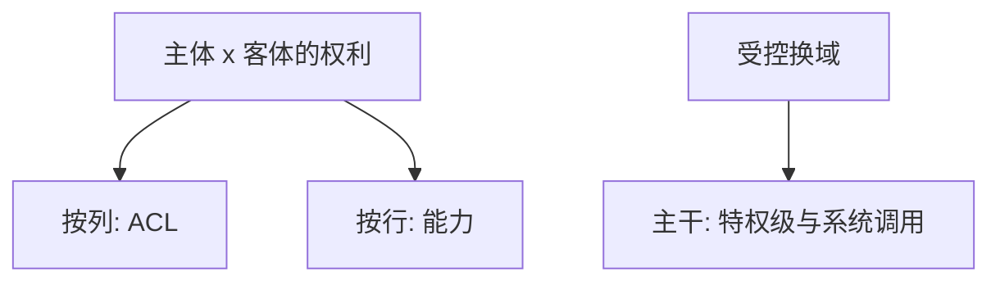

# Lampson 保护

保护是主体、客体与权利的矩阵；机制应能表达政策，而不把政策焊死在某一种操作系统里。

<footer>—— Lampson, Protection, 1971；重刊 ACM Operating Systems Review, 1974</footer>

[上一课](/cs/lamport-clocks)附录对照了无共享时钟时的因果。附录对照，不插入主干。主干已在[访问控制与最小特权](/cs/acl-least-priv)、[DAC/MAC/RBAC](/cs/dac-mac-rbac)、[能力对 ACL](/cs/capability-vs-acl)里用过保护矩阵与两种存放；这里对照 **Lampson 原文的问题**：如何把「谁可以对什么做什么」写成可实现的抽象，并讨论域切换与放大。不重做 Unix mode。

## 问题

Lamport 处理事件序，不处理授权。Lampson 的缺口是保护：访问矩阵、域、把矩阵按列存成 ACL、按行发成能力，以及从用户态进入更特权域的受控门。主干安全课在数据库之后才命名 CIA，但矩阵观念来自这篇。附录只对照原文如何把保护从「操作系统功能列表」里抽成对象。

Saltzer 与 Schroeder 1975 把最小特权等原则写成更长的教程。Lampson 更短、更机制。不要给两篇发明编号。

## 方法

矩阵条目是权利。当前域决定能用哪一行。系统调用是换域。能力必须不可伪造（标签、加密、或硬件）。主干能力课已取用「持票即允许」；ACL 课取用按客体存名单。本附录不把 RBAC 写回 1971。

## 机制

一旦保护是矩阵，完整中介、失败安全、最小特权才有落点。THE 分层是结构；Lampson 补的是权利语言。后文 Cerf–Kahn 管互联，不管矩阵——所以安全课不能提前用 1974 网络文代替本篇。

### 为何对照而不插入主干

主干按系统栈：先比特与 OS 隔离硬件，安全课在库之后才开 CIA。把 1971 插在 THE 之后当必修「下一课」，会让读者以为保护是 OS 附录而不是安全主干。本篇只对照原文对象。

## 边界

不要把 1971 与 Bell–LaPadula 混成一篇。也不要在附录里开信息流形式语义。下一篇对照 Cerf–Kahn 1974 分组互联。

对照结束应回到主干[访问控制](/cs/acl-least-priv)与[特权级](/cs/privilege-rings)。保护矩阵不插入网络课中间。

## 小结

- 附录对照 Lampson 1971/1974：保护 = 矩阵 + 换域。
- 主干 ACL/能力课已取用；本篇不插入安全课之前当课序。
- 出处：Lampson, Protection, 1971/1974。
