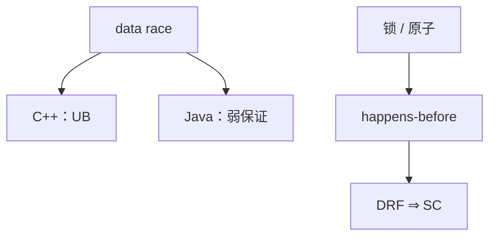
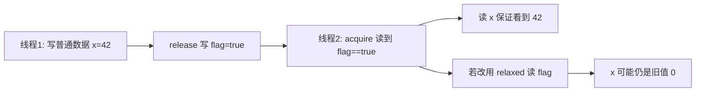

# 语言内存模型与 data race

没有 data race 时，程序等价于某种交错的顺序一致执行。有 race 时，C/C++ 是未定义，Java 仍限制可见性。编译器重排必须遵守 happens-before。

<footer>—— 据 Adve and Hill；Boehm and Adve, Foundations of the C++ Concurrency Memory Model；Java Memory Model（JSR-133）整理</footer>

上一课[反射](/cs/reflection-metadata) 可在运行时改字段，并发更乱。缺口是**语言级内存模型**：什么重排合法，data race 是不是 UB。接[UB 与优化](/cs/undefined-behavior-opt) 与组成课一致性，但不重讲总线。WebAssembly 下一课当目标。

## 问题

优化想把 load 提出循环；另一线程在写。无模型则要么禁止优化要么允许乱看。JMM/C++11：原子与锁建立 happens-before。缺口是**编译器合同**，不是硬件 MESI 细节。

Data race：冲突访问、至少一个写、无排序。C++：UB。Java：不崩型，但值可撕仅限非 volatile 的 long/double——仍几乎不可写。

术语翻译：happens-before 就是跨线程的「可见性承诺」——它说的不是钟表时间上的先后，而是「如果 A happens-before B，A 写过的数据 B 必须能读到」。两个访问只要谁也不向谁做这种承诺、其中还有写，就是 data race。

### 内存模型不是 GC 写屏障

GC 屏障维持三色；内存模型屏障维持可见性。JIT 可能同一条 store 两件事，概念分开。

Boehm–Adve 2008。JSR-133。Adve–Gharachorloo 综述硬件。本课语言层。不写利用级竞态教程。

## 方法

IR：`atomic` 带序（relaxed/acquire/release/seqcst）。优化：不跨原子乱序普通访问。逃逸到多线程的对象：锁消除要证明无逃逸。

```mermaid
flowchart TD
  RACE["data race"] --> C["C++：UB"]
  RACE --> J["Java：弱保证"]
  SYNC["锁 / 原子"] --> HB["happens-before"]
  HB --> SC["DRF ⇒ SC"]
```

与 fast-math 无关；与并发 GC 的对象发布有关：必须安全发布。

## 机制

编译器+硬件共同实现模型。`volatile` 在 Java 与 C 意义不同——点名坑。不要用普通 load 当旗。

DRF-SC：无 race 则程序员可当顺序一致想。有 race 的 C++ 程序优化可删除看起来「有用」的代码。

直觉类比：release 写像快递「封箱并贴单」，acquire 读像「看到单子才开箱」。配对必须落在同一个变量上——线程 1 release 写 flag，线程 2 acquire 读 flag，开的是同一个箱子，箱里（flag 之前写的普通数据）才保证完整可见；换成 relaxed 读，等于不看单子直接翻包裹，里面可能还是空的。

常见误区：初学者常拿 C 的 `volatile` 当锁用。实际上 C 的 volatile 只告诉编译器「别把这几条访问优化掉或重排到别处」，对 CPU 的乱序和缓存可见性毫无约束；Java 的 volatile 才同时给了原子性、可见性和禁止特定重排。用 C volatile 做线程旗标，在多核机器上就是 data race。

```mermaid
flowchart LR
  W["线程1: 写普通数据 x=42"] --> R["release 写 flag=true"]
  R --> L["线程2: acquire 读到 flag==true"]
  L --> S["读 x 保证看到 42"]
  L --> RLX["若改用 relaxed 读 flag"]
  RLX --> MAY["x 可能仍是旧值 0"]
```

这张图回答的问题：release/acquire 配对到底「传递」了什么。答案是把 flag 之前发生的一切写操作打包对另一个线程可见；relaxed 原子只保证自身是原子的，不携带任何其他数据的可见性，这正是「旗标必须 acquire/release」的原因。

## 边界

本课不写全部内存序表。后课默认：优化受内存模型约束。下一课 WebAssembly 作目标：另一 ABI+线性内存。

也不把模型当经济学博弈。

## 小结

- DRF ⇒ 顺序一致交错；C++ race 是 UB。
- 原子序限制重排；与 GC 屏障不同。
- 锁消除、LICM 必须看逃逸与同步。
- 出处：Boehm and Adve；JSR-133；Adve and Hill。
