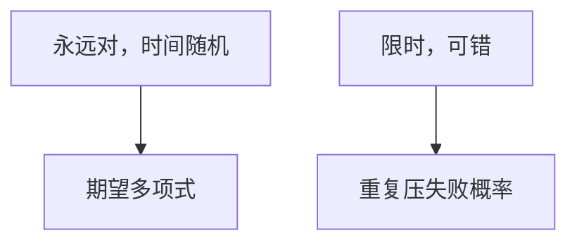

# Las Vegas 与 Monte Carlo

Las Vegas 永远正确、时间随机；Monte Carlo 限时、以小概率错。重复与双边错误把 RP/BPP 与期望多项式分开。

<footer>—— 据 Motwani and Raghavan, Randomized Algorithms, 1995；[随机化算法直觉](/cs/randomized-algo)；CLRS 第 5 章整理</footer>

上一课[Karger 最小割](/cs/karger-min-cut)是典型 Monte Carlo：可能报更大的割。主干已分两类。本课缺口是**钉术语**并接上 Karger、rho、指纹：何时可变成 Las Vegas（有验证器）。不重写指示器。后课 Freivalds 指纹。

## 问题

Las Vegas：输出正确，如随机快排、随机增量几何（期望 $O(n\log n)$）。可中止重来，期望时间有界。Monte Carlo：Karger、Miller–Rabin（单侧）、指纹相等（碰撞则可能错）。单侧错误可重复压概率。有确定性多项式验证（NP 证书或最小割再检查）则 MC 可改 LV：错就重抽，直到验证过。

缺口是分类，不是新算法。

### 期望多项式不是最坏多项式

LV 最坏可很长。MC 最坏时间固定。不要把「平均输入」与「算法内硬币」混。

Motwani–Raghavan。RP：单侧错；BPP 双侧。本课算法，复杂度类点名。后课 Freivalds 是 MC 矩阵乘检验。

## 方法

写算法时声明：错从哪来、能否验证、重复几次。Karger：可用流验证全局割是否等于报的值（对无向）。指纹：碰撞无法本地验证相等。

错误概率对最坏输入取，不是平均实例。

## 机制

重复 $k$ 次独立，失败 $(1-p)^k$。双侧错误要 Chernoff 或多数票。与近似比：随机近似给期望比或高概率比，后课。与在线：在线没有「重复整个输入」。

## 边界

本课不证 $P=BPP?$。不写全部 RP 完全问题。后课默认：先分 LV/MC 再分析。下一课指纹与 Freivalds。

## 小结

- LV 正确；MC 可错可限时。
- 有验证器则 MC 可改 LV。
- Karger 是 MC；快排是 LV。
- 出处：Motwani and Raghavan, 1995；CLRS。
