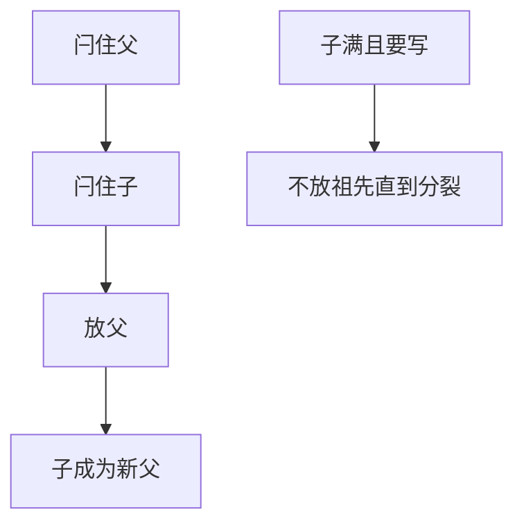

# latch crabbing

从根到叶蟹行：先闩孩子再放父亲，使分裂不会在未保护的路径上发生；读可乐观，写才耦合。

<footer>—— 据 Lehman and Yao, Efficient Locking for Concurrent Operations on B-Trees, TODS 1981；Mohan 与 ARIES/IM；Gray</footer>

[上一课](/cs/pin-latch)区分 pin 与 latch。本课不重定义写闩。缺口是 B+ 遍历：若从根到叶一路持有所有闩，并发插入几乎停。crabbing（蟹行 / latch coupling）：持父闩，闩住孩子，立刻放父，使窗口里最多两层。分裂时要再向上，协议更严。

## 问题

主干 B+ 分裂课讲结构，几乎单线程。并发：读者看内部节点指针时，写者可能分裂把键挪走。安全：写遍历在可能分裂的节点上保持闩直到确定孩子「安全」（有空槽）才放父；不安全则保持以便回头分裂。读：可在每层放闩后乐观继续，若发现链接不一致则重试——Lehman-Yao 的右链指针让读不挡写。

缺口是**协议**，不是 B+ 阶数。与事务行锁：行锁在叶记录上，latch 在页上，先 latch 后 lock 或按引擎规定的顺序，避免两层死锁。

Lehman and Yao TODS 1981，B-link 树。ARIES/IM 讨论索引并发与恢复。本课用 crabbing 统称耦合闩锁，不把每篇变体的位图抄进来。

## 方法

读：根闩 → 找孩子 → 闩孩子 → 放根 → … → 叶。若节点带删除或分裂标记，按右链走或重从根。写：类似，但在满节点上不放祖先，或用「安全节点」截止。SMO（结构修改）要记日志，恢复与 ARIES 索引一致。

Bw-tree 下一课用无闩+映射表，是另一族；本课先钉经典页闩。

## 机制

pin 与 latch 一起：闩住的页必 pin。蟹行失败（要再向上）时可能重新从根，避免持有长链。高并发下根是热点：根几乎不分裂后可变只读闩优化，或把根钉死在池里。

性能：读蟹行短，写 SMO 长。与 2Q 互动：内部节点应常驻，替换策略应偏爱高层页。

## 边界

本课不讲 Bw-tree 的 delta 记录。也不把间隙锁当 latch。间隙锁是事务级，后课。

后课默认：B+ 并发读蟹行或 B-link；写在不安全节点上耦合。Bw-tree：用映射表与 delta 减少写闩。

蟹行保护的是页指针正确，不是幻读；幻读要谓词锁或间隙锁。

## 小结

- 蟹行同时最多闩两层（读），写在可能 SMO 时延长。
- B-link 右链让读乐观。
- Bw-tree 下一课：无传统写闩的映射+delta。
- 出处：Lehman and Yao 1981；ARIES/IM；Gray and Reuter。
