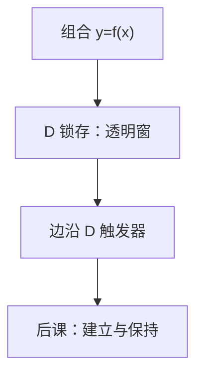

# 锁存与触发器

组合网没有记忆；要让比特在时钟拍之间还在，必须用交叉耦合或边沿采样把状态关进回路里。

<footer>—— 据 Harris and Harris, Digital Design and Computer Architecture 整理</footer>

上一课[PLA 与 ROM 作组合](/cs/pla-rom)把组合算术收到「三种比较」。本课不重接线旗标，也不从操作系统进程另起。缺口是：到现在所有块都是 $y=f(x)$。计数器、寄存器、后课 PC，需要 $y$ 依赖**过去**。数字逻辑在这里进入时序：锁存与触发器。

## 问题

组合反馈可以振荡或进入亚稳，不能当受控记忆。缺口是受控存储元件：电平敏感的 **D 锁存**在时钟高（或低）时透明、否则保持；边沿敏感的 **D 触发器**只在上升沿（或下降沿）把 D 送入 Q。后课同步设计默认触发器，避免透明造成的环路同时导通。

SRAM 单元也是交叉耦合，但是阵列课的对象；本课只钉 1 比特的锁存/FF。

### 锁存不是触发器

教科书与口语常把 flip-flop 与 latch 混用。本栏：latch 电平透明，FF 边沿。用两个锁存主从可以拼成 FF。把锁存当 FF 用在同一时钟上，保持时间与环路会一起坏。

Harris 用时序图区分透明窗与边沿。本课不把 JK、T 触发器当主干：它们可由 D 与组合构成。异步置位清零当端口承认，不展开异步状态机。

## 方法

SR 交叉耦合：禁止 $S=R=1$ 的那种。D 锁存：时钟选通，透明时 $Q=D$。主从：前级锁存在时钟一半透明，后级在另一半，整体边沿。触发器输出 Q 在周期内除边沿外保持。

## 机制

有了 FF，才能切出「周期」：周期内组合计算，边沿更新状态。后课寄存器是并排 FF；FSM 的现态是一组 FF。时钟尚未多域，本课假设单时钟理想边沿。亚稳态：若 D 在边沿附近变，Q 可能长时间不合法——量化是下一课建立保持。复位可以同步接到 D 的 MUX，也可以异步进 FF 端口；主干默认同步复位，避免与时钟竞争。

## 边界

本课不讲 PLL、不把 DRAM 电容当 FF。不引入多时钟。组合逻辑险象若打在锁存透明窗里会被放行；FF 只采样边沿附近。

后课默认：同步状态存在边沿 D 触发器里；锁存仅在明确的透明协议里使用。

## 小结

- 记忆需要锁存或触发器；组合反馈不是受控状态。
- 锁存电平透明；FF 边沿采样。
- 时序约束（建立/保持）下一课才写成不等式。
- 主干默认同步复位，避免异步端口与时钟竞争。
- 出处：Harris and Harris。
