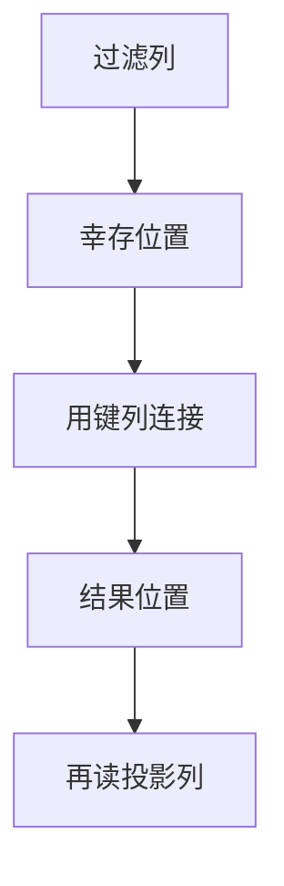

# 延迟物化

扫描先只碰过滤与连接键列，RID 或位置向量拖到需要投影时才解引用；列存上这是默认，行存上是少回表。

<footer>—— 据 Abadi, Myers, DeWitt and Madden 列存物化策略；Boncz 等；覆盖索引对照</footer>

[上一课](/cs/parallel-exchange)会把元组在工人间搬运。本课不选 broadcast。缺口是**何时组装完整行**：早物化（扫描时读出所有列）简单，shuffle 与哈希表变宽；迟物化（late materialization）只传递位置与少量键，谓词与连接之后再取投影列。执行引擎单元在此封口，存储进阶从缓冲池再开。

## 问题

列存：各列分开。先读选择率高的列做过滤，幸存位置再取其他列，I/O 与解压都少。行存：覆盖索引已是一种迟物化（不回堆）；否则 RID 列表过滤后再堆取，可能随机 I/O 比早读整行更差——校准决定。

缺口是策略选择，不是新代数。连接：可用键列连接得到 RID 对，再取载荷列。聚合：只取分组键与聚合列。

Abadi et al. 比较 early/late materialization。PAX 把行组与列存折中，后课。本课执行策略与存储格式耦合，但语义仍是同一投影。

## 方法

位置列表（selection vector / RID 向量）在算子间传递。扫描接口：按列拉向量，按位置 gather。缓存：迟取可能打乱页顺序，要批量化 gather 成对页友好的顺序。

与向量化天然合一：批就是一段位置。编译生成 gather 循环。并行：shuffle 只发键+位置，载荷在目标节点本地读——存算分离时位置必须仍能寻址。

## 机制

更新与 MVCC：位置必须绑定快照，版本回收不能在查询还拿着 RID 时物理重用——后课 MVCC GC。行存删除空洞使 RID 仍有效直到 vacuum。

代价：迟物化增加随机 gather；选择率高时早物化更好。优化器应估计幸存率再选策略，误差又回来了。

## 边界

本课不讲 LRU-K 替换。也不把宽列数据库的列族当迟物化的同义词。执行引擎收口：从迭代器、向量、编译、排序、哈希、Grace、exchange 到物化时机。

后课默认：OLAP 列路径迟物化；点查行路径早读整行或覆盖索引。缓冲池下一课：页在内存里如何替换，迟 gather 打的就是它。

传递更窄的向量，是并行与列存的同一条减流量原则。

## 小结

- 迟物化推迟投影列 I/O；高选择率时可能更差。
- 位置必须绑定快照，不能提前回收。
- 下一单元缓冲池 LRU-K / 2Q：页替换服务扫描与 gather。
- 出处：Abadi et al.；Boncz 等；覆盖索引对照。
