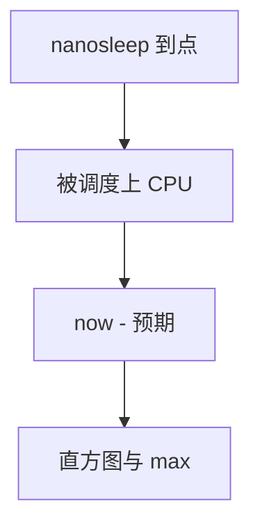

# 延迟测量 cyclictest

cyclictest 按设定周期醒来，记录「应当醒来」与「实际醒来」之差，画出内核调度与抢占延迟的尾部。

<footer>—— 据 rt-tests 的 cyclictest 文档；OSADL 对实时 Linux 测量的实践</footer>

[PREEMPT_RT](/cs/preempt-rt) 声称有界。[EEVDF](/cs/eevdf) 声称尾延迟更好。缺口是 **怎么量**：cyclictest 测的是唤醒延迟，不是应用业务延迟。

## 问题

任务 `clock_nanosleep` 到点，看 now-expected。直方图：max 才是 RT 关心的。缺口：必须隔核、关 HT、注意 [NAPI](/cs/napi) 与 ksoftirqd；tracer 本身扰动。本课不把 OSADL 农场的全部配置复制过来。

用户循环里的计时要用 CLOCK_MONOTONIC_RAW 一类，避免 NTP 跳。对象是调度延迟，不是网卡 RTT。

## 方法

绑 FIFO 高优先级 → 周期性睡眠 → 记录差。对照 [perf](/cs/perf-sampling) 后课：perf 看热点，cyclictest 看最坏唤醒。对照 [blkio](/cs/blkio-cgroup)：I/O 负载是扰动源，应同时加压。对照 fsync：那是存储完成，不是 CPU 唤醒。

## 机制

测量把「实时」从口号变成分布。没有加压的 max 没有意义。不要写成示波器使用课。与 [tickless](/cs/tickless-nohz) 后课：无 tick 会改变唤醒路径，测量要注明模式。

结果不可在虚拟机与裸机间直接比，除非声明半虚拟时钟。

实现上：无负载的 cyclictest 只测空闲路径，要同时用 hackbench 或网络打满。虚拟机里测的是宿主注入，不是裸机。CLOCK_MONOTONIC 可能含 NTP 调整，测抖动用 RAW。 读法上只引用[上一课](/cs/preempt-rt)的结论，不把对象换成训练推理或限价簿。

本课在操作系统进阶的「调度进阶 / 公平、实时与能耗」课序里，对象是 **延迟测量 cyclictest**。

- 先修只引用，不重导：上一课的结论当公理，本课只补差。
- 五栏不吞并：不把本课写成大模型训练/推理，也不写成限价簿或权重量化。
- 文献用 OSTEP、McKusick、内核文档与具名会议论文；不发明 arXiv 编号。

## 边界

本课不引入所有 tracing 事件。不保证手机 SoC 的数字可移植。下一课用 cgroup 管 CPU 组：组调度。

版本字段会变，课序钉的是机制对象「延迟测量 cyclictest」，不是某一主线内核的结构体名。
后课默认：唤醒延迟可用周期睡眠直方图刻画。cgroup cpu 控制器如何摊权重与限额，下一课。

## 小结

- cyclictest 量周期唤醒误差的尾部。
- 必须加压与绑核才有解释力。
- cgroup CPU 组调度是下一课。
- 出处：rt-tests cyclictest；OSADL；POSIX 时钟。
