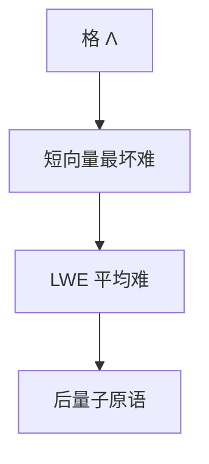

# 格与 LWE 直觉

格是 $\mathbb{R}^n$ 中的离散子群。短向量难；带误差的线性方程（LWE）平均难，且可从最坏格问题归约——后量子候选停在这一不对称上。

<footer>—— 据 Micciancio and Goldwasser；Regev, On Lattices, Learning with Errors, 2005, 2009 整理</footer>

上一课[椭圆曲线](/cs/elliptic-curve-group) 的 DLP 被 Shor 打穿。缺口是**格**：$\Lambda=B\mathbb{Z}^n$。SVP、CVP 最坏难（某些近似因子下 NP-hard）。Regev 的 LWE：给 $(A, As+e \bmod q)$，$e$ 小噪声，求 $s$。平均实例可证至少与最坏格一样难。本课直觉，不写 Kyber 参数。

## 问题

好基（近正交）上 SVP 易；坏基（约化差）上同一格难。公钥是坏基，私钥是好基——这是 Ajtai、GGH 的老图像，实现要防攻击。LWE 把「噪声线性代数」当 OWF 形状：无噪声则高斯消元；有噪声则统计上像均匀（对合适参数）。[OWF 课](/cs/one-way-functions-avg) 点名过最坏到平均；本课落地。

不要把 LWE 写成机器学习课：这里的误差是为困难而加，不是拟合数据。

### 不是 RSA 的模 $n$

模 $q$ 是小整数（万到万千），维 $n$ 几百。困难来自高维噪声，不是大整数分解。

Regev 2005/2009。Micciancio–Regev 综述。Ajtai 1996 最坏到平均。NIST 后量子：Kyber/Dilithium 基于 MLWE/Module，本课不替代规格书。

## 方法

画二维格的短向量 vs 长基。写 LWE 样本形状。对照 QR / DLP：量子算法对 LWE 无已知多项式解（Shor 不适用）。指出：参数选错（噪声太小/太大）会易解或解密失败。

## 机制

数论单元结束：从同余到域、DLP、素性、ECC，最后格。逻辑单元下一课起不再用 LWE。密码学主干协议仍可用 ECC；本补层只把「量子之后的候选困难」钉在格上。

SIS（短整数解）是对偶图像，点名。

SIS：已知 $A$，求短 $e\neq 0$ 使 $Ae=0\bmod q$。LWE 是「带噪声的求逆」。环/模 LWE 用多项式环降公钥体积，也引入代数结构攻击，参数要谨慎。与 QR、DLP 分工：量子算法目前没有 Shor 式的周期发现可套。数论单元到此结束。

## 边界

本课不证 Regev 归约，不引入理想格环上的攻击。不把区块链当应用。后课默认：LWE 是带噪线性方程的平均困难，来自格。下一单元命题逻辑与 CNF。

短向量几何难；LWE 把难改写成带噪线性方程的平均情形，并有最坏到平均归约。模数小、维数高，与 RSA 大整数不是一类。数论补层到此交给逻辑。

上一课留下的缺口在本课收口；「格与 LWE 直觉」进入后课词汇表后只引用。文献用来钉对象与边界，不把本课写成该主题的独立综述。

## 小结

- 格上短向量难；坏基藏几何。
- LWE：噪声破坏消元，平均 $\leftarrow$ 最坏。
- Shor 不直接打穿；参数敏感。
- 出处：Ajtai；Regev, 2005/2009；Micciancio and Goldwasser。
