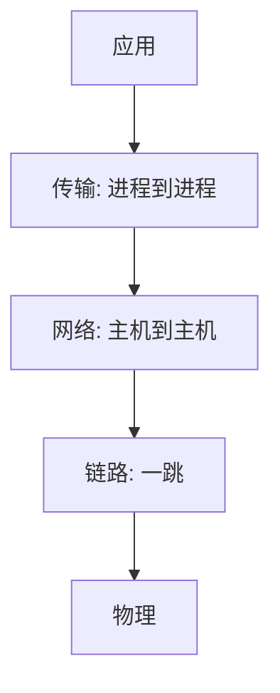

# 分层与端到端

功能只应放在端系统能完成且正确的那一层；下层的「几乎正确」不能代替端到端的检查。

<footer>—— 据 Saltzer, Reed and Clark, End-to-End Arguments in System Design, ACM TOCS 1984 整理</footer>

[上一课](/cs/virtio)把客机 I/O 收到半虚拟化队列；操作系统课到此结束。[I/O 与 DMA](/cs/io-dma)已经能把设备字节搬进一台机器的内存。两台机器之间还没有共享的名字：对方的缓冲不是我的物理帧，总线事务过不了机箱。缺口是**互连**：先约定分层，再用端到端论证约束「可靠性该放哪」。本课不把 MAC 地址写完。

## 问题

若把文件语义（完整字节流、进程描述符）直接铺到电线上，每种应用都要重做调制。若只在链路上做完美可靠，文件传输仍要在两端核对：链路重传挡不住中间节点内存出错。Saltzer 等的论证：文件传送的正确性只能在两端用校验与重试保证；链路层的努力是性能优化，不是正确性替代。缺口是这句分工，加上分层：相邻层通过接口服务，对等层通过协议。

套接字需要[进程](/cs/process-image)与[文件](/cs/file-bytestream)，但本课还没有端口；只承认「主机」将出现。

端到端不是「不要下层校验」。下层校验降低端到端重传频率。论证反对的是：把端到端才能做对的功能只放在下层并声称已经够了。

## 方法

教学用五层直觉：应用、传输、网络、链路、物理。IP 把异构链路连成互联网（Cerf 与 Kahn 的分组互连）；传输把进程接上；链路把相邻跳接上。本课不把 OSI 七层当必须背诵的真理，只要求：每层有 PDU 与对等协议，上层 PDU 是下层的载荷。

## 机制

分层让 DMA 进来的字节被解释成帧、包、段，而不是「又一份磁盘块」。端到端论证解释后课 TCP 校验与应用层校验为何同时存在：磁盘与路由器内存都不在文件两端的信任域里。VFS 的 `read` 在一台机器上结束；跨机器必须把「流」做成协议，而不是共享 inode。

本课之后，第一跳如何给帧加上可转发的链路地址，下一课 MAC。

## 边界

本课不引入跨层优化的全部例外（有意识地打破分层），不把电信信令网当互联网主干。也不把端到端与「网络中立」政策混成一课。加密与认证的端到端是更后的 TLS 入口，这里只借 Saltzer 的文件传输例子。

把加密只放在链路层，换一条跳就明文：这也是端到端要把机密性放到真正两端的理由，后课 TLS 入口会收回。

后课默认：功能按层放；正确性在真正的两端收口。相邻机器上的一跳需要帧与硬件地址，下一课。

## 小结

- DMA 只解决单机搬字节；跨机要协议分层。
- 端到端：下层优化性能，两端保证正确。
- 一跳的帧与 MAC 是下一课。
- 出处：Saltzer, Reed and Clark, *ACM TOCS* 1984；Cerf and Kahn, 1974；Kurose and Ross。
