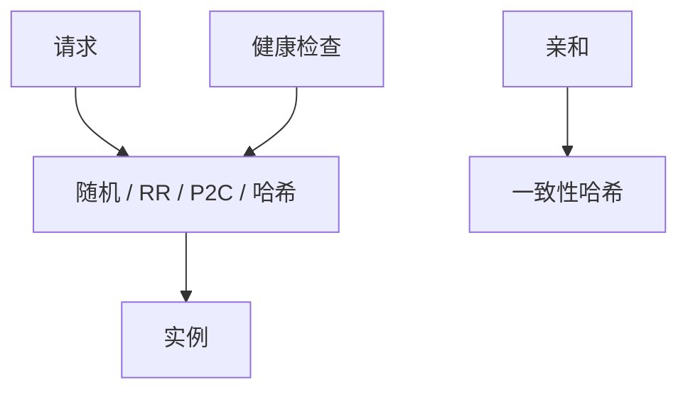

# 负载均衡策略

把请求分到实例上。随机与轮询不管队列；最少连接与 P2C 看忙闲。均衡的是负载，不是一致性档。

<footer>—— 据 Mitzenmacher, The Power of Two Choices；Dean and Barroso 对选择与排队的讨论整理</footer>

上一课[对冲](/cs/tail-latency-hedging)要挑「另一副本」。缺口是**第一次挑选**的策略：轮询、随机、一致性哈希、最少连接、两随机取短者（P2C）。本课钉这些策略与缓存亲和的冲突。通信与可靠课序在此封口，下一课序从追踪开始。

## 问题

无状态服务：随机/轮询简单，在实例异构或长请求时会把某人队列打长。P2C：随机看两个，去队列更短的，Mitzenmacher 证明在许多模型下指数改善最长队列。有状态：一致性哈希粘滞会话与缓存命中，接[会话保证](/cs/session-guarantees)与缓存；实例增减要虚节点，数据结构课已有哈希环。

缺口：LB 把请求打到落后从库，线性一致掉档——策略必须读规格，不只读 CPU。健康检查是[故障检测器](/cs/failure-detectors)的边缘实现，误摘机会放大剩余者负载。

Power of two choices：Azar、Broder、Karlin、Upfal 与 Mitzenmacher 的球箱模型。数据中心 LB 是其工程投影。

## 方法

L4 vs L7：L7 能按路径与头选池。加权：按规格容量。连接数 ≠ 队列深度，长轮询会骗最少连接。对冲的第二份应避开第一份的实例，且避开不健康池。

不要把全局最少连接做成中心瓶颈；P2C 用局部采样。

## 机制

羊群：所有 LB 看见同一「最闲」实例，一起打过去——信息延迟造成振荡。P2C 与随机化减轻羊群。与熔断：摘除病实例后，剩余者限流要收紧，否则转移风暴。

本课不写 Maglev、GSLB 全部。也不写 CPU 调度 CFS。

亲和与均衡冲突：粘得越死越不均，越均越破 RYW 与缓存。产品选点要显式。

## 边界

本课不把服务网格 sidecar 当新算法。后课默认：无状态用 P2C 或加权随机；有状态用哈希并接受再均衡代价；一致性读要打主或带读索引的副本，不能只打「最闲从库」。追踪下一课给每次挑选留下因果。

均衡器改变的是延迟分布与命中率，不改变对象是否线性一致。

## 小结

- 轮询/随机忽略队列；P2C 用两次采样压最长队。
- 哈希粘滞换缓存与会话，牺牲均衡。
- 健康检查误摘会制造转移风暴。
- 出处：Mitzenmacher 两选择；Dean and Barroso。
