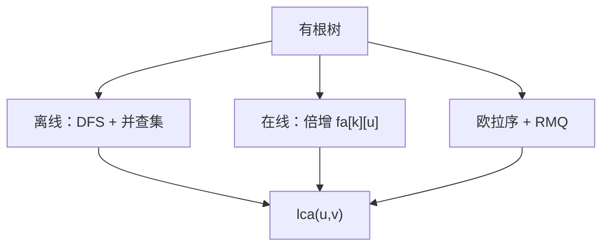

# 最近公共祖先

树上两点的最近公共祖先是同时盖住二者的最深顶点；离线并查集或在线倍增、欧拉序加 RMQ，都能答。

<footer>—— 据 Tarjan, Applications of Path Compression on Balanced Trees, 1979；Harel and Tarjan, Fast Algorithms for Finding Nearest Common Ancestors, 1984；Bender and Farach-Colton, The LCA Problem Revisited, 2000 整理</footer>

上一课[哈密顿与 TSP 精确解](/cs/hamiltonian-tsp-exact)在一般图上指数。本课把图收成**树**（或有根树）：两点之间唯一路径，询问最近公共祖先（LCA）。不重做子集 DP。缺口是查询结构——离线一次扫完，或预处理后在线。后课倍增把同一技巧用到路径聚合与树上差分。

## 问题

有根树，$lca(u,v)$ 为 $u$、$v$ 的公共祖先中深度最大者。路径 $u$–$v$ 就是 $u$ 到 $lca$ 再下到 $v$。朴素双指针上跳 $O(n)$ 每次。缺口是更快：离线 $m$ 次询问，或预处理后 $O(1)$/$O(\log n)$。

Tarjan 离线：DFS 时用并查集维护「已处理子树的代表」；回溯时把询问另一端已访的点与当前点求 LCA。一次 DFS + 几乎 $O(n+m)$。在线：预处理深度与父，或欧拉序（进出把树摊成序列，LCA 变成序列上的 RMQ）。

### RMQ 不是另一道题

欧拉序上相邻深度差 $1$，$\pm 1$ RMQ 可 $O(n)$ 预处理、$O(1)$ 查询（Bender–Farach-Colton）。一般 RMQ 稀疏表 $O(n\log n)$–$O(1)$。本课认「LCA $\leftrightarrow$ RMQ」，不把稀疏表写成另一课程。

Tarjan 1979 离线并查集。Harel–Tarjan 1984 讨论在线线性预处理。Bender–Farach-Colton 2000 把 $\pm 1$ RMQ 写清楚。后课树上倍增是同一父指针的对数张表。

## 方法

小 $n$ 可倍增：`fa[k][u]` 为 $u$ 的 $2^k$ 祖先，预处理 $O(n\log n)$，查询先对齐深度再一起跳，$O(\log n)$。离线用并查集。需要常数查询再用欧拉序 RMQ。

森林：先找根；不同树无 LCA，或虚根。

## 机制

括号序/欧拉序：第一次访问时刻之间的点，深度最小者即 LCA（更精确：欧拉序区间内深度最小的顶点）。倍增：深度差的二进制分解是在链上跳，与[二进制快速幂](/cs/fast-exponentiation)同一「倍增」念头，后课才把矩阵幂展开；本课只跳父指针。

不要在有环图上定义 LCA：最近公共祖先依赖树（或 DAG 上要另定义，本课不写）。

## 边界

本课不写重链剖分（下一课的下一课）、不写点分治。动态加点、换根在线是另一模型。后课默认：树上两点路径经过 LCA；倍增表是标准预处理。下一课把倍增接到路径和与树上差分。

## 小结

- LCA 是两点路径的最高点；树上路径唯一。
- 离线并查集；在线倍增或欧拉序 RMQ。
- 一般图的「祖先」没有这一定义。
- 出处：Tarjan, 1979；Harel and Tarjan, 1984；Bender and Farach-Colton, 2000。
