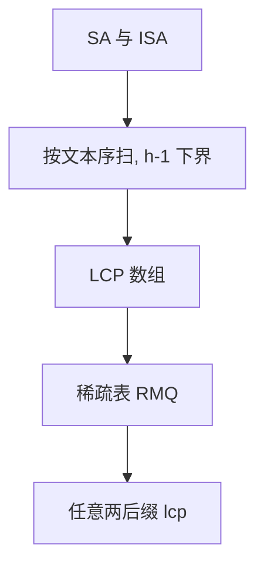

# LCP 与 Kasai

$H[i]$ 是 $SA$ 上相邻两后缀的最长公共前缀；Kasai 用 $ISA$ 按文本顺序扫，摊还线性算出整张 $H$。

<footer>—— 据 Kasai et al., Linear-Time Longest-Common-Prefix Computation in Suffix Arrays and Its Applications, CPM 2001；Manber and Myers 整理</footer>

[上一课](/cs/suffix-array) 二分时可能对 $P$ 反复比已经相等的前缀。RMQ 若建在 $LCP$ 上，任意两后缀的 LCP 是 $SA$ 区间最小值——接回[稀疏表](/cs/sparse-table)。本课不重排后缀。缺口是定义 $LCP$ 数组，以及 Kasai 线性算法。

## 问题

$LCP[i]=\mathrm{lcp}(T[SA[i-1]..], T[SA[i]..])$（下标约定课内固定一种）。已知 $SA$ 与 $ISA$，Kasai：按 $k=ISA$ 的文本位置 $i=0,1,\ldots$ 考虑后缀 $T[i..]$ 与在 $SA$ 中的前一名。若上一步 LCP 为 $h\gt 0$，则这一步至少 $h-1$（去掉一个字符）。缺口是**用这个 $h-1$ 下界避免从零比**，合计比较 $O(n)$。

Kasai et al., CPM 2001。有了 LCP，后缀数组 + RMQ 可模拟后缀树许多查询。

## 方法

实现：`h=0`，对 `i in 0..n-1`，若 `ISA[i]>0`，令 `j=SA[ISA[i]-1]`，从 `h` 起比较 $T[i+h]$ 与 $T[j+h]$，写入 `LCP[ISA[i]]`，然后 `h=max(0,h-1)`。任意两后缀 $p,q$ 的 lcp 等于 $LCP$ 在 $SA$ 上两者秩之间的最小值。

应用：本质不同子串个数 $n(n+1)/2-\sum LCP$；重复串；与 KMP 前缀函数不同——这里对全体后缀。

## 机制

正确性：文本位置 $i$ 与 $i+1$ 的后缀关系给出 $h$ 的传递。不要在无哨兵时让比较越界。LCP 最小值用静态 RMQ，不需 Fenwick。

后缀树把这些 lcp 变成显式边，下一课收指针树；本课数组已够多数统计。

## 边界

本课不写稀疏后缀数组。动态 LCP 维护复杂。后缀树与 SAM 仍有「所有出现位置」的显式 coprime 结构需求。

后课默认：静态 $SA$ 必配 $LCP$。要显式后缀链与边，用后缀树。

## 小结

- $LCP[i]$：SA 相邻后缀公共前缀长。
- Kasai：$O(n)$ 借助 $h-1$。
- 任意对 lcp = 区间最小 LCP。
- 出处：Kasai et al., CPM 2001；Manber and Myers。
