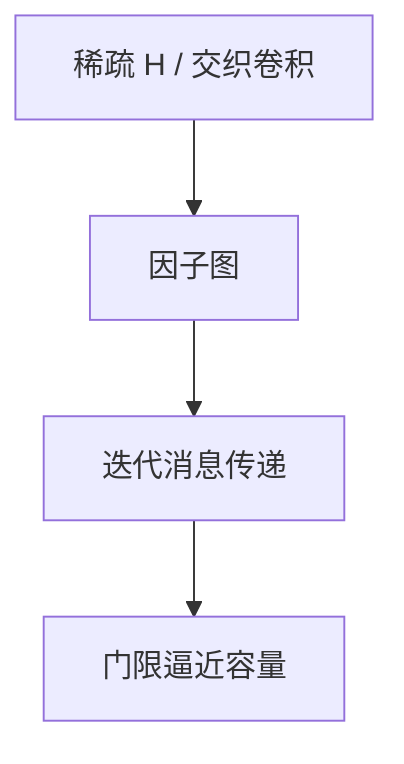

# LDPC 与 Turbo 直觉

稀疏校验图上的迭代消息传递，以及交织的两个卷积码互相当先验：实践中逼近 Shannon 容量，证明却是密度演化与经验。

<footer>—— 据 Gallager, 1963；Berrou, Glavieux and Thitimajshima, 1993；Richardson and Urbanke 整理</footer>

上一课[卷积与 Viterbi](/cs/convolutional-viterbi) 的状态随记忆指数涨，离容量远。缺口是**近容量码**：LDPC（稀疏 $H$）与 Turbo（并行级联卷积）。本课直觉：因子图、迭代、门限；不写 5G 标准。

## 问题

Gallager：校验矩阵稀疏，每个校验含少数变量。译码：在 Tanner 图上传递「这比特是 0/1 的似然」，迭代。环短会骗过迭代，随机大图以高概率好。Turbo：两个系统卷积码，中间交织；解码器交换外信息。二者都不是代数最小距离设计的主路，而是统计物理式的阈值：$E_b/N_0$ 高于门限则错误瀑布下降。

对照 Hamming/RS：那里 $d_{\min}$ 精确；这里瀑布 + 错误平层（平层由小重量码字造成）。

### 迭代不是最大似然

Viterbi 在网格上 ML。LDPC 的 BP 在有环图上只是近似。容量附近 ML 不可行（码太长），迭代是工程最优。

Gallager 1963 被忽视，1990s 复活。Berrou et al. 1993 Turbo。Richardson–Urbanke 密度演化。MacKay 的现代编码观点。PCP 的「局部校验」不是本课的信道译码。

## 方法

画一张小 Tanner 图：变量圆、校验方。描述一次迭代。点名：码长 $10^4$ 量级才显近容量，短码仍可用 RS。不要把深度学习译码当定义。

## 机制

Shannon 随机码不可实现；LDPC/Turbo 是可描述的伪随机码，译码多项式（相对块长）。容量课的存在性至此有构造性近似。外码仍常用 RS 去平层。

与单向函数无关：这里的「随机」是码设计，不是密码学困难。

密度演化在树状展开上追踪消息分布，预测门限。有环则分析是近似。极化码（Arikan）用另一条可证达容量的构造，5G 控制信道用过，本课点名。平层：增大最小距离或外接 RS 可压。短码场景代数码仍常胜。

## 边界

本课不推密度演化积分，不写 5G NR 的基图。不引入极化码（Arikan）全文，点名：另一条达容量路线。后课默认：近容量实用码 = 稀疏图迭代。下一课允许失真：率失真。

近容量来自长码上的统计门限，不是精确 $d_{\min}$ 设计。BP 有环时非 ML。与 PCP 的「局部校验」同形不同题：这里是信道噪声，那里是证明系统。

上一课留下的缺口在本课收口；「LDPC 与 Turbo 直觉」进入后课词汇表后只引用。文献用来钉对象与边界，不把本课写成该主题的独立综述。

## 小结

- LDPC：稀疏校验 + 迭代 BP；Turbo：交织卷积互译。
- 逼近 $C$，代价是长码、平层、非 ML。
- 与代数码分工：统计门限 vs $d_{\min}$。
- 出处：Gallager, 1963；Berrou et al., 1993；Richardson and Urbanke。
