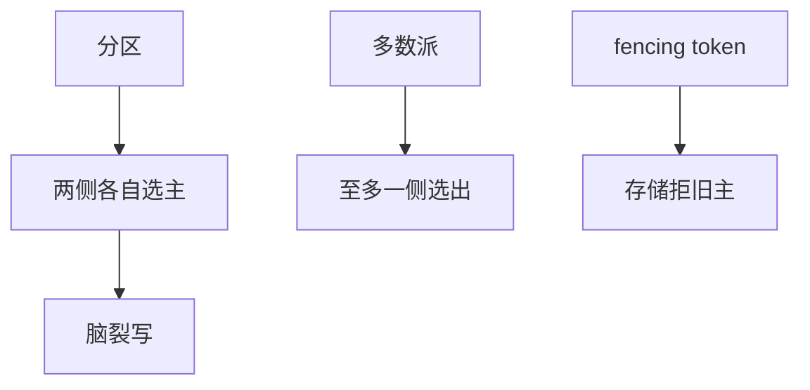

# 领导者选举与脑裂

分区两侧各选一个主，就是脑裂。心跳选主只解决活，fencing 与多数派才解决「至多一个有效主」。

<footer>—— 据 Lamport Paxos / Ongaro Raft 的任期规则；Gray and Cheriton 租约整理</footer>

上一课[共识与 2PC](/cs/consensus-vs-2pc)指出单协调者会堵。人们于是「选个新协调者」。缺口是**两侧同时成功**：那不是高可用，是分叉写。[主备](/cs/primary-backup-failover)已点过 fencing，本课把选举算法与脑裂收成一条课，不重写 Raft 日志匹配。后课锁服务是选举结果的用户。

## 问题

选举规格常被写成：终有一个主（活性）、至多一个主（安全）。[FLP](/cs/flp-impossibility)说异步确定下二者不能兼得。工程选举：Bully（最高 id）、Raft 投票、ZK 临时节点。只比谁超时谁当选，在分区下**两侧都当选**。

脑裂定义：两个节点同时认为自己持有同一互斥角色，且客户端或存储都接受双方的写。安全破坏是分叉，不是「切换慢」。

多数派选举：同一任期只有一个能拿到多数票，因为票不相交。少数派分区选不出。这是 CP。

## 方法

防脑裂三件套（可组合）：

1. 多数派投票 / 共识任期。
2. 租约：旧主期限未到新主不接写。
3. 存储 fencing token：IO 带单调令牌，存储拒旧令牌。

不要用「再加一层心跳」当 3 的替代：心跳过不了分区。

## 机制

Raft：term 单调，AppendEntries 拒小 term；多数派保证同 term 一主。旧主在分区里仍自认主，但它的写凑不齐多数派，不能提交——若它**对外部存储**直写绕过日志，仍会脑裂。所以角色必须覆盖所有副作用路径。

ZK/etcd 选主：临时节点最小者当主，会话超时后节点消失。会话超时依赖[租约](/cs/leases)算术；超时设太短会误杀，太长则 failover 慢。误杀加没 fencing 的副作用 = 脑裂。

本课不把 DNS 主备切换当多数派。也不写区块链的最长链（后课 PoW 是另一种「谁说了算」）。

## 边界

本课不比较所有选主库的 API。不引入拜占庭多主。后课默认：宣布领导者必须有 fencing 故事；多数派选举给「至多一个能提交」，租约给「至多一个能被客户端信」，存储令牌给「至多一个能写盘」。分布式锁下一课把令牌变成锁服务产品。

活性要分区愈合；安全要在分区期间仍「至多一个有效主」。有效 = 其写被系统接受。

## 小结

- 脑裂是两主的写都被接受，不是切换慢。
- 多数派选举让少数派选不出；还要对副作用 fencing。
- 心跳不能穿过分区去取消另一侧的主。
- 出处：Raft/Paxos 任期；Gray–Cheriton 租约。
