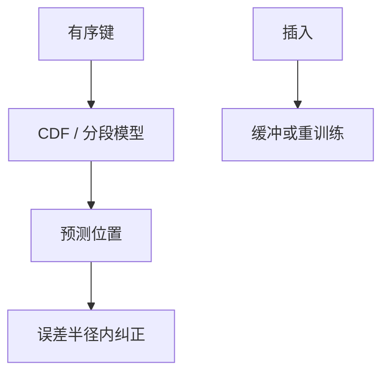
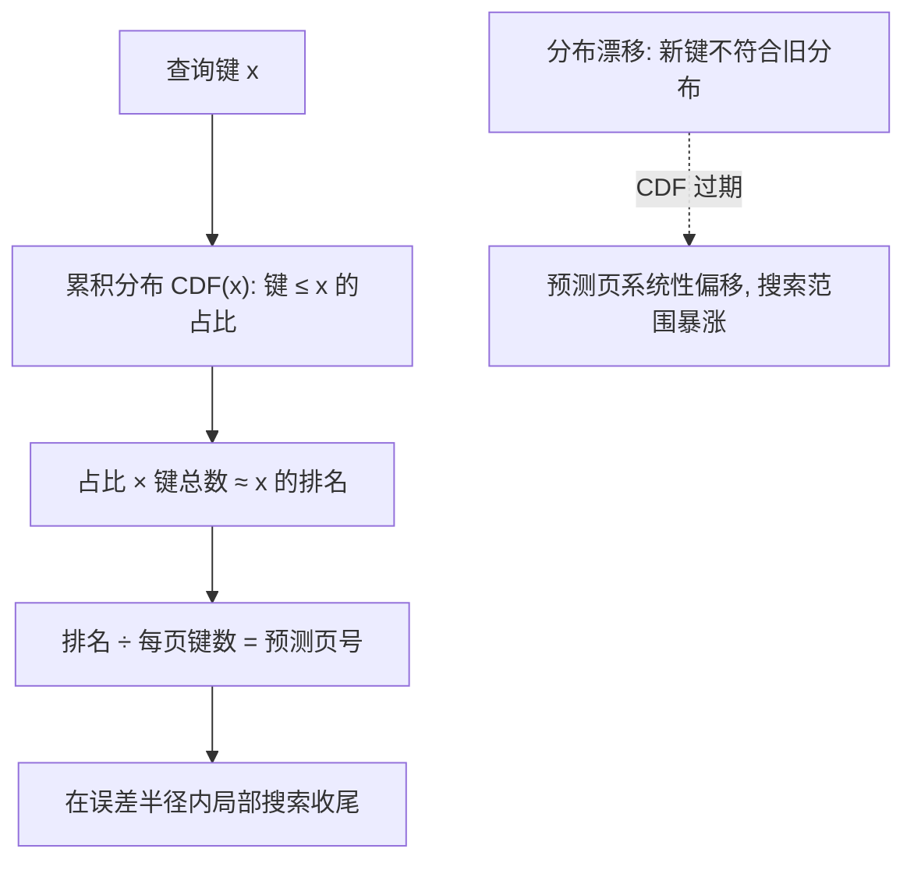

# 学习索引

把有序键到位置看成回归：模型预测页号，再局部纠正。分布稳定时少一层指针，分布一漂就变成错页扫描。

<footer>—— 据 Kraska et al., The Case for Learned Index Structures, SIGMOD 2018；B+ 对照</footer>

[上一课](/cs/spatial-index-db)的键没有全序友好。本课回到一维有序键。缺口是：B+ 用内部节点存分隔键；若键分布可用函数逼近，模型可预测叶位置，内部节点缩小或消失。学习索引（learned index）是存储结构上的模型，与学习型优化器（选计划）不是同一插件。

## 问题

静态有序数组上，CDF 模型预测 rank，误差界限内二分纠正。动态插入：要增量训练或混合结构（RMI + 缓冲树）。缺口是**工作负载假设**：只读或追加、键分布缓变。OLTP 随机插入、删除空洞，模型过期则预测偏差大，最坏退化成大范围扫描——比 B+ 最坏对数更差。

与 ART/Bw：那些是精确结构。学习索引用近似+纠正。事务、并发、恢复都要定义「模型版本」与页一致性。

Kraska et al. SIGMOD 2018。后续有动态学习索引。本课不把神经网络当 B+ 的默认替换。无虚构编号。

直觉类比：B+ 树像进图书馆每层都问导航台「下一层往哪走」；学习索引像把全馆布局背下来——「编号 37 万的书大约在第 4 排第 3 架」，一步到位，找错了几架就在旁边挪几步。代价是：一旦馆里大规模搬书（键分布漂移），背下的地图就系统性指错。

## 方法

训练：用键与位置拟合分段线性或小网络。查询：预测 → 在误差半径内搜。更新：缓冲新键，定期重训练，或把学习索引当只读段（LSM 里对 SST 建模型，不可变正好）。

优化器：代价按预测误差半径的期望探测次数，需校准。

```mermaid
flowchart TD
  KEY["有序键"] --> MOD["CDF / 分段模型"]
  MOD --> POS["预测位置"]
  POS --> FIX["误差半径内纠正"]
  UPD["插入"] --> RET["缓冲或重训练"]
```

## 机制

LSM+学习：对每个不可变 SST 训一个小模型，compaction 后重训，避开动态问题。B+ 内部页减少缓存占用，是论文卖点；要对比 ART 的前缀压缩是否已经够。

正确性：纠正步骤必须找到真键或证明不存在，不能只信模型。

数字实例：10 亿键、每页 100 键。B+ 树高约 4 层，每层可能一次缓存未命中（约 100 ns），点查约 400 ns；CDF 模型预测只是一次乘加（几纳秒），误差半径 10 个键内的二分只要三四次比较——「少一层指针」省的就是内部节点那几次内存访问。

常见误区：初学者担心「模型预测错了会返回错的键」。不会：纠正步骤只在真实数据上收尾，找到真键或证明不存在，正确性不靠模型。模型错误的代价是**性能**——误差半径变大，局部搜索涨成大范围扫描，最坏退化为线性，连 B+ 的对数界都保不住。

```mermaid
flowchart TD
  X["查询键 x"] --> CDF["累积分布 CDF(x): 键 ≤ x 的占比"]
  CDF --> RANK["占比 × 键总数 ≈ x 的排名"]
  RANK --> PG["排名 ÷ 每页键数 = 预测页号"]
  PG --> FIX["在误差半径内局部搜索收尾"]
  DRIFT["分布漂移: 新键不符合旧分布"] -.->|CDF 过期| WRONG["预测页系统性偏移, 搜索范围暴涨"]
```

这张图回答的问题：一个「模型」凭什么能当索引。有序键的排名就是其经验 CDF 乘以总数——CDF 天生是「键到位置」的函数；模型只是把这个函数拟合下来。最后一行是它的命门：拟合的是**过去**的分布，键一漂移预测就整体偏。

## 边界

本课不讲变长溢出页。也不把学习索引用于空间 MBR（研究有，主干不依赖）。字符串键、多列组合键的模型更脆。

后课默认：学习索引适合只读或 LSM 段上的有序点查；OLTP 默认精确树。变长记录与溢出页：行存页装不下时的经典问题，与模型无关。

近似结构必须有精确收尾，否则隔离与约束都无法谈。

## 小结

- 学习索引回归键到位置，再用局部搜索纠正。
- 动态更新与分布漂移是硬边界；LSM 段上更自然。
- 变长记录与溢出页下一课：行在页里如何拆。
- 出处：Kraska et al. SIGMOD 2018；B+ / ART 对照。
