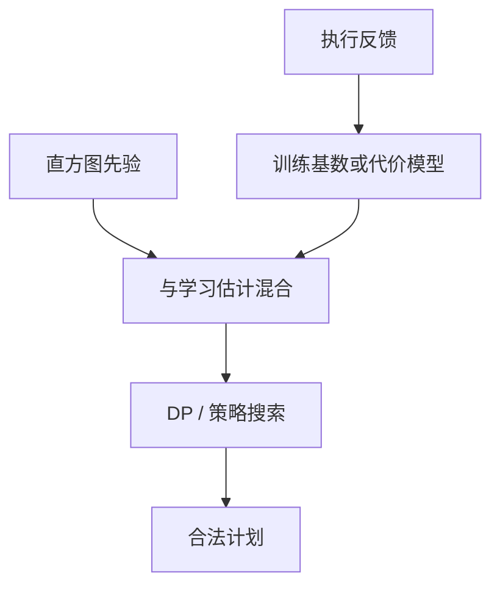

# 学习型优化器

把过去计划的真实延迟与基数当训练信号，下一次搜索用模型代替或修正直方图公式；泛化失败时仍要能退回 Selinger。

<footer>—— 据 Marcus et al. Neo；Yang et al. 学习基数；Krishnan et al.；传统 Selinger 对照</footer>

[上一课](/cs/adaptive-query-processing)在单次执行中途纠偏。本课不重做监测点。缺口是跨查询的记忆：相似语句反复出现，自适应每次都付探测税。学习型优化器（learned optimizer）用历史 `(查询特征 → 计划, 运行时间)` 或学习基数估计，改变 DP 的输入或直接提议树。

## 问题

手工直方图与独立假设是强先验。学习模型（树、神经网络）拟合工作负载，可能在相关列、复杂谓词上更准。缺口是**工作负载漂移**：训练在白天报表，晚上 ETL 分布不同，模型会自信地选错。还有计划空间合法性：模型不能提议外连接左右颠倒的非法树。

与计算机栏的机器学习课分开：这里模型只服务代价或基数，不是训练 Transformer。特征是表、列、谓词、估计行数，标签是真实行数或延迟。

Neo（Marcus et al.）等把计划搜索与学习价值函数结合。学习基数估计有大量后续工作。本课只钉：学习是修正估计或搜索策略，不是取消代数指称。

## 方法

两条路：① 学习基数，DP 照旧；② 学习代价或策略，引导枚举。必须保留回退：模型不可用时走直方图 + Selinger。训练数据来自 explain analyze、自适应监测、采样。过拟合到某次参数窥视，等于把计划缓存的坏处学成权重。

解释性：DBA 要能问「为什么选 NLJ」。纯黑盒在回归事故里不可运维——后课计划提示与稳定性。

## 机制

冷启动：新表无历史，必须经典统计。缓存：学习计划同样要在模式变更时失效。安全：探索（试试新计划）可能把生产打慢，通常在副本或限流下探索。

学习估计若系统性低估，灾难与经典误差同类，只是更难用「加桶」修好——要有监控估计/实际比。

## 边界

本课不讲索引选择的学习版细节——下一课索引选择与下推仍以经典为主，学习可作辅。也不把自动调参整个 DBMS 当一课。

后课默认：学习模型是统计模块的插件，指称与事务不变。索引选择课处理「建哪些物理结构」，与「给定结构选哪条路」分开。

没有反馈回路的「学习」只是一次拟合，会过期。

## 小结

- 学习修正基数或搜索，必须合法、可回退、可失效。
- 工作负载漂移与不可解释是运维边界。
- 索引选择与条件下推下一课：物理设计与改写的交界。
- 出处：Marcus et al. Neo；学习基数估计文献；Selinger 对照。
