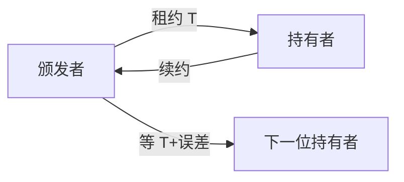

# 租约

租约是带期限的授权：期内持有者可当主，过期授权作废。时钟误差必须折进期限，否则会出现两个同时有效的主。

<footer>—— 据 Gray and Cheriton, Leases: An Efficient Fault-Tolerant Mechanism for Distributed File Cache Consistency, SOSP 1989 整理</footer>

上一课[故障检测器](/cs/failure-detectors)的怀疑可以来回抖。缺口是**短时的确定性**：在接下来 $T$ 秒内，「谁说了算」不许并行有效。本课不重写 $\Diamond\mathcal{P}$。后课 FLP 会说明：没有时间假设就没有这种确定性窗口——租约正是把[物理时钟](/cs/clock-drift)的 $\varepsilon$ 请回安全论证。

## 问题

缓存失效：服务器改文件后要通知持有副本的客户端。若客户端崩了，通知永远等不到。Gray–Cheriton：授予租约，到期后服务器可以当客户端已放弃缓存，不必等 ack。推广：领导者租约、锁租约——都是「到期即收回」，避免无限等故障。

缺口：两台机器的钟差。若颁发者认为已过期，持有者认为还剩一秒，就会双主。必须让颁发者的等待 $\ge$ 持有者的期限 $+ 2\varepsilon$ + 最大延迟（按你声明的钟模型）。单调钟不能跨机比较期限，墙钟必须带 $\varepsilon$。

Chubby、ZooKeeper 会话、Raft 的 leader lease 变体都是这条期限算术。本课讲算术，不讲具体共识消息。

## 方法

颁发：记下 `expiry = now + T`（带误差预算）。持有者只用到 `now_local + T - slack`。续约必须在过期前完成一轮 RTT。过期后颁发者才能把同一权授给别人。

与检测器：租约期内颁发者**假装**强准确（不把持有者当死）；过期后完备性靠等待而不是靠心跳猜。心跳仍可用于提前打破（持有者主动交还），但不能省略过期路径。

## 机制

文件缓存：写时等所有未过期租约失效或收回，再写。比逐客户端可靠 ack 更抗崩溃。元数据锁同构。对象存储、DNS TTL 是弱租约：过期后读可能旧，那是缓存语义，不是互斥授权。

时钟回拨：持有者若墙钟回拨会以为租约更长——必须用单调钟量经过时间，用颁发者的权威时间定义绝对过期。这是上一课「超时用单调钟」的直接应用。

本课不把租约写成线性一致寄存器：它只排除「两个授权重叠」。授权里的值是否线性一致，是复制课的事。

## 边界

本课不证 FLP，不引入拜占庭租约（恶意持有者可以忽略过期）。不把 DHCP lease 当分布式互斥教材。后课默认：领导权、锁、缓存失效若用租约，期限算术必须含 $\varepsilon$；没有同步假设就没有无重叠保证。下一课说明为何纯异步连「终将选出唯一主」也不能既安全又活。

租约是把部分同步**局部化**成一段时间的互斥，不是取消异步安全证明。

## 小结

- 租约 = 期限化授权；过期路径代替无限等故障。
- 颁发者等待必须覆盖持有者期限与时钟误差。
- 持有者用单调钟量流逝；跨机过期用带 $\varepsilon$ 的权威时。
- 出处：Gray and Cheriton, SOSP 1989。
