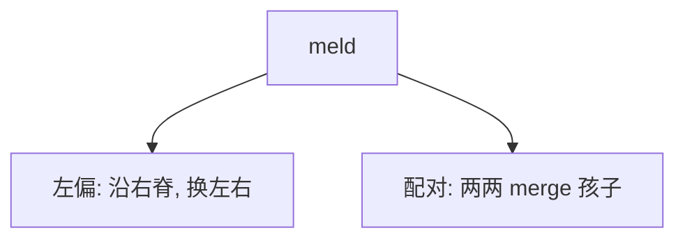

# 左偏树与配对堆

堆不必是完全二叉树：左偏用 $npl$ 强迫右脊短，合并沿右脊走；配对堆把合并做成更懒的一对一对。

<footer>—— 据 Crane, Linear Lists and Priority Queues as Balanced Binary Trees, 1972；Fredman, Sedgewick, Sleator and Tarjan, The Pairing Heap, Algorithmica 1986 整理</footer>

[上一课](/cs/concurrent-skip-list)是有序字典。优先队列主干若只是数组二叉堆，合并两堆是 $\Theta(n)$。[摊还](/cs/amortized-analysis) 语言已有。本课不写跳表 CAS。缺口是可合并堆的两个实用成员：左偏堆与配对堆，为后课 Fibonacci / 二项提供对照。

## 问题

`meld(H1,H2)` 要快。二叉堆数组做不到共享形状。左偏堆：节点有键堆序，再维护 $npl$（到最近外节点的最短距离），规定左 $npl\ge$ 右 $npl$。合并：递归合并右脊与另一堆，再必要时交换左右以恢复左偏。右脊长度 $O(\log n)$，故 meld/insert/delete-min 最坏 $O(\log n)$。

配对堆：根的孩子们是无序半堆，delete-min 后把孩子两两配对再沿链收。实现极短；摊还界历史上多轮改进，教学上当「实践快、分析厚」的可并堆。

Crane 的左偏树是早期可并堆。配对堆 Fredman et al. 1986；Iacono 等后续摊还结果，本课不引不存在的编号。

## 方法

左偏 merge：若一空则返回另一；否则键小的当根，把它的右孩子与另一堆 merge，再 swap 左右若破坏 $npl$。插入是与单节点 merge。配对：insert 当新根或挂孩子；decrease-key 常割下子树再 merge 回——细节随实现，本课钉「割与 meld」。

与数组堆：可并；索引 decrease-key 要句柄。不要用左偏当排序数组。

## 机制

左偏的 $npl$ 类似零路径长，保证右脊短，分析干净。配对堆常数小，图算法里常赢 Fibonacci 的理论 $O(1)$ decrease-key——理论与实践分裂从这里开始，下一课 Fibonacci 把 $O(1)$ 摊还减键写清。

## 边界

本课不证明配对堆的最佳摊还常数。不引入斜堆（skew heap）全文，只承认它是「无 $npl$、随机或交换」的亲戚。二项堆用明确的秩合并，后两课。

后课默认：要可并且实现短，左偏或配对。要理论 $O(1)$ 减键，看斐波那契堆。

## 小结

- 左偏：npl + 右脊合并，最坏对数 meld。
- 配对：实现短，摊还分析更长。
- Fibonacci 堆下一课追 $O(1)$ decrease-key。
- 出处：Crane, 1972；Fredman et al., *Algorithmica*, 1986。
