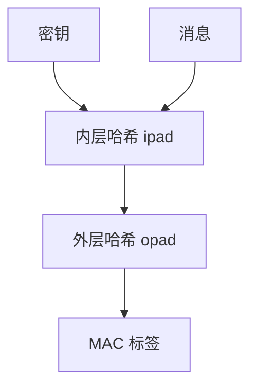

# 长度扩展与 HMAC

知道 Merkle–Damgård 的 $H(m)$ 往往等于知道链状态，于是可伪造 $H(m\|\mathrm{pad}\|s)$ 而不知 $m$。HMAC 把密钥以嵌套哈希拌进去，关掉这条，并成为标准 MAC。

<footer>—— Krawczyk, Bellare and Canetti, HMAC, RFC 2104；Bellare, Canetti and Krawczyk 的分析</footer>

## 定位

上一课[海绵](/cs/sha3-sponge)从结构上弱化了长度扩展。缺口是：SHA-2 仍是 MD，**裸哈希不能当 MAC**。主干[MAC 与签名](/cs/mac-signature)已点名 HMAC；本课把长度扩展收成机制。不给伪造操作步骤。

后课默认已经读完本课钉下的合同，只补差，不从该领域第一性原理重开。

## 问题

若认证做成 $H(k\|m)$，MD 下敌手可在未知 $m$ 时扩展。$H(m\|k)$ 另有填充与碰撞问题。HMAC：$H(k\oplus\mathrm{opad}\|H(k\oplus\mathrm{ipad}\|m))$。缺口是理解「为何嵌套」，不是再定义 MAC 游戏。

### 海绵也不要用裸 $H(k\|m)$ 凑合

KMAC 按海绵合同拌密钥。算法换了，域分离不能省。

RFC 2104。安全归约依赖压缩函数的 PRF 性质（Bellare 后来的证明）。本课不提供长度扩展的字节级配方。

## 方法

陈述 MD 状态与摘要的关系。给出 HMAC 嵌套。对照 AEAD 内建标签：HMAC 仍用于旧协议、HKDF、许多 API 签名。指出时序上 HMAC 比较应常数时间。

图中节点是本课的机制骨架；课程不把图展开成可运行的攻击步骤。

## 机制

MAC 证明持有 $k$ 的人认过消息。长度扩展说明「抗碰撞哈希」≠「带密钥认证」。HMAC 把 PRF 需求放到哈希上，工程上可换 SHA-256/SHA-3。签名仍是非对称，下一课生日界先回来管碰撞。

前提写进合同之后，游戏外的误用只当失败模式点名，不在本课写成操作程序。

## 边界

本课不把 Poly1305、CMAC 写全。生日攻击下一课：碰撞的平方根界，既管哈希也管 CTR 分组。

## 小结

- MD 摘要可当链状态，裸 $H(k\|m)$ 不够。
- HMAC 嵌套关长度扩展，是标准 MAC。
- 常数时间比较标签，避免再开预言。
- 下一课生日界：碰撞的定量。
- 出处：RFC 2104；Bellare, Canetti and Krawczyk；对照 FIPS 198-1。
