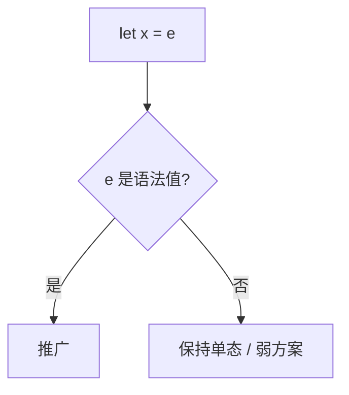

# let 多态与值限制

只有 let 绑定的、形态像值的表达式才被推广。否则可变单元会把同一个类型变量实例化成互不相干的类型。

<footer>—— 据 Tofte, Operational Semantics and Polymorphic Type Inference, 1988；Wright, Simple Imperative Polymorphism, 1995；Milner, 1978 整理</footer>

上一课[算法 W](/cs/hindley-milner-w)在纯 λ+let 上于 `let` 处 $\mathrm{Gen}$。缺口是**引用与副作用**：`let r = ref (fn x => x) in (r := ...; !r)` 若把 $r$ 推成 $\forall\alpha.\,\mathrm{ref}(\alpha\to\alpha)$，读写会毁掉健全性。值限制：只对语法值（λ、常量、某些构造）推广。本课钉这条工程规则，不重写 W 的合一。

## 方法

先看反例直觉：空列表 `[]` 是值，可给 $\forall\alpha.\,\mathrm{list}\,\alpha$；`ref []` 不是值，类型钉成某未知 $\alpha$ 的 $\mathrm{ref}(\mathrm{list}\,\alpha)$，不能一会儿当 `int list` 一会儿当 `bool list` 去写。

Wright 把限制说成「可推广的是值」；SML 与 OCaml 各有放宽（子表达式、膨胀）。Haskell 纯默认无此坑，`IORef` 仍要小心。

### 值限制不是「禁止多态」

`let id = fn x => x` 仍是 $\forall\alpha.\,\alpha\to\alpha$。限制打击的是**计算出来的、可能写入的单元**，不是 λ。

Wright 1995（Lisp and Symbolic Computation）。Tofte 的论文与 SML 定义是历史来源。Pierce TAPL 讨论 imperative polymorphism。本课不把区域推断写进来，生命周期在后课。

## 问题

W 的 $\mathrm{Gen}(\Gamma,\tau)$ 量化 $\tau$ 中不在 $\Gamma$ 出现的变量。若 $\tau=\mathrm{ref}\,\alpha$ 且 $\alpha$ 不在 $\Gamma$，推广在逻辑上「合法」却与更新语义冲突：$\alpha$ 会在运行时被钉死两次。缺口是**类型方案与可变存储的交互**，不是子类型。

与[作用域](/cs/scope-symtab)：值限制是类型规则，不是名字解析。

## 机制

放宽：若能证明表达式无副作用（纯）或类型不含 ref，可再推广。编译器分析须保守。错误信息：「不能推广」常表现为后续使用处类型冲突，要把原因指回 `ref`。

不要用 `let` 包一层无意义的 `id` 来绕过限制却引入副作用——那是人为打破健全性的尝试，语言应仍拒绝或钉单态。

## 边界

本课不写 ML 模块的弱类型变量全文。后课默认：HM + 值限制才与可变存储共存。下一课子类型：另一条「类型之间的宽化」，与量化正交。

也不把 Rust 的借用当值限制的特例；所有权后课另起。

## 小结

- let 多态在 `let` 处推广；值限制限制谁配推广。
- `ref` 与更新使任意 $\mathrm{Gen}$ 不健全。
- 纯 λ 无此问题；命令式 ML 必须收。
- 出处：Wright, 1995；Tofte；Milner, 1978。
