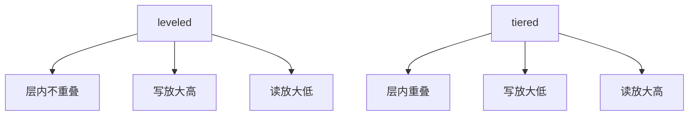

# leveled 对 tiered

leveled 让每层内部几乎不重叠、容量按倍增；tiered 让同层多个等大文件重叠，归并更懒，写轻读重。

<footer>—— 据 LevelDB 的 level 设计；Cassandra 对 size-tiered；RocksDB universal；O'Neil LSM</footer>

[上一课](/cs/lsm-read-amplification)用布隆砍点查 I/O。本课不调假阳性。缺口是 compaction **形状**：同样「多层有序文件」，层内是否允许重叠决定写放大 vs 读放大的主曲线。leveled（分层）与 tiered（分层大小/万能归并族）是两端。

## 问题

leveled：第 $i$ 层容量约 $T$ 倍于第 $i{-}1$ 层，层内键范围不重叠（L0 例外）。compaction 把上一层文件与下一层重叠切片归并进去，每字节大约走过每层一次，写放大高，点查每层至多一文件。tiered：同层堆积多个相似大小文件，重叠允许，直到 $T$ 个再整体归并到新层；写放大低，点查同层要看多个文件。

缺口是选工作负载：写多（指标、消息）偏 tiered；读多点查偏 leveled。混合策略（RocksDB universal 等）是工程插值，本课钉两端。

LevelDB 普及 leveled。Cassandra 早期 size-tiered。写停顿形态不同：leveled 持续小归并，tiered 偶发大归并。空间放大：未回收的旧版本在 tiered 上常更大。

## 方法

配置：层倍率 $T$、L0 触发文件数、每层压缩器。监控：每层文件数、pending compaction bytes、写停顿次数。换形状等于换放大合同，要伴随容量规划。

与校准：优化器若把 LSM 表当堆，两种形状的扫描代价都估错；至少应区分「点查期望文件数」。

## 机制

墓碑回收：leveled 把键推进底层更快，删除空间回收更可预测。tiered 大归并才丢墓碑。快照持有阻碍两者的回收，同 MVCC。

L0：两种都可能堆积，刷盘快于 compaction 时读放大先在 L0 爆炸——布隆课的最坏情况。

## 边界

本课不讲列存 PAX。也不把 compaction 当 VACUUM 的同义词——Postgres heap 后课。LSM 形状是文件集合的不变量。

后课默认：点查多选 leveled；写吞吐选 tiered 或混合。列存与 PAX：分析型页布局，与 LSM 文件内部编码可叠加。

没有一种形状同时最小写、最小读、最小空间。

## 小结

- leveled：层内不重叠，写重读轻；tiered 相反。
- L0 堆积是共同的读放大源头。
- 列存与 PAX 下一课：页内把列放在一起服务扫描。
- 出处：LevelDB；Cassandra；O'Neil LSM；RocksDB。
