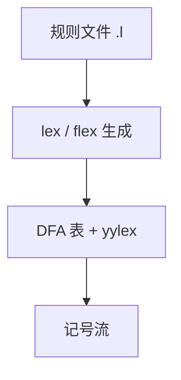

# lex / flex

规则写成正则与动作；生成器交出一张表驱动的扫描器，而不是让人在源码里手画全部转移。

<footer>—— 据 Lesk and Schmidt, Lex — A Lexical Analyzer Generator；Levine, Flex &amp; Bison；龙书第 3 章整理</footer>

上一课[word RAM](/cs/word-ram)把算法进阶收到字模型与位并行。本课起「程序语言与编译进阶」：主干已会[正则与词法](/cs/regex-lexer)、[NFA 与 DFA](/cs/nfa-dfa)、[Thompson 构造](/cs/thompson-nfa)，缺口不是再证正则等于有穷自动机，而是**生成器**——lex / flex 如何把规则文件编译成扫描函数。后课默认已经读完本课：词法规则进 `.l`，动作吐记号，冲突按最长匹配与表序消解。不重写 Transformer，不进限价簿。

## 问题

手写 DFA 能切标识符，一改关键字表就要改状态图。lex 的输入是「模式–动作」对：模式是正则，动作是嵌入的 C（或等价宿主）。生成期：规则并成 NFA，确定化、压缩成表；运行期：`yylex` 读字符，走表，匹配成功执行动作。缺口是这份**规则编译**，不是再定义 lexeme。

与证明助手无关的是实现层：扫描器必须终止、必须对源长近似线性；lex 把「会不会写错转移」从人挪到生成器。进阶课从这里接主干前端，不重开 λ 的 β。

### 规则表不是 CFG

`if` 与标识符的冲突由最长匹配和规则先后决定，不是移进归约。括号嵌套仍不是正则；flex 的起始条件（`%x COMMENT`）只是有限个词法模式，数不了任意层嵌套语法。

Lesk 的 lex 与 GNU flex 是同一契约的实现。龙书把生成器当词法章的工程落地。本课不把 Unicode 标识符写完，那是本课序末尾的编码课。

## 方法

写 `.l`：定义段、`%%`、规则、用户子程序。动作里 `return TOK`，`yytext`/`yyleng` 指向本次 lexeme。关键字可写进规则，或标识符之后查表覆写——与主干词法课同一约定，这里由生成器保证最长者胜。

调试冲突：flex 的 `--debug` 与规则编号；同长度时看规则在文件中的次序。不要在动作里再扫描字符绕过 DFA，那会毁掉行号与位置。

## 机制

表压缩（行压缩、等价类）降低缓存压力，不改变语言。回溯：最长匹配要记住最后接受态，失败则回退输入指针——这是词法约定，不是 NFA 的 ε。flex 的 `REJECT` 会重试次长匹配，代价高，进阶课点名即可，默认不用。

与 yacc 对接：`yylex` 的返回值是记号种别，`yylval` 带语义值。本课只保证扫描器接口；语法生成器下一课。

起始条件把注释、字符串字面量从「一个大正则」里拆成模式机：进入 `COMMENT` 后只认注释内规则，直到 `*/`。这仍是有穷状态，不是下推。

## 边界

本课不写 bison 的产生式，不处理 GLR。不把 flex 的全部选项当手册抄录。后课默认：词法由生成器从正则规则得出；语法的输入是 `yylex` 的记号。下一课用同一风格接 yacc / bison。

生成器吃正则，不吃任意 CFG。源编码、宏展开会在词法前后插刀，本课序后段再补；此处假定字节或已规范化的字符流。

## 小结

- lex / flex：正则规则编译成表驱动 `yylex`。
- 冲突：最长匹配，其次规则序；不是 LR 冲突。
- 与主干词法课同一分工：记号正则、嵌套归语法。
- 出处：Lesk and Schmidt；Levine, *Flex & Bison*；Aho et al., 龙书第 3 章。
