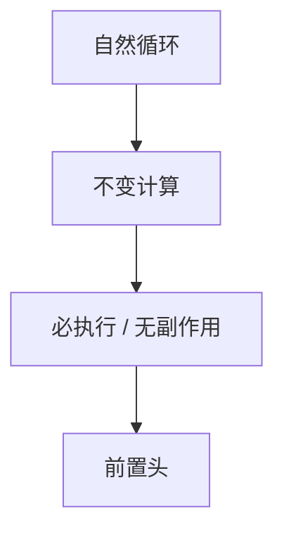

# 循环不变量外提

若计算在循环每一圈结果相同，且外提安全，就搬到前置头执行一次。安全包括异常、别名与执行频率。

<footer>—— 据 Allen and Cocke, A Catalogue of Optimizing Transformations；龙书 9.5；Muchnick 整理</footer>

上一课[DCE](/cs/dce-adce)删死的。缺口是**活但不随迭代变**的表达式：`t = n*4` 在 `for` 里。LICM：识别循环、找不变、外提到 preheader。主干点过循环；自然循环识别后课正式收。本课假定可识别自然循环与前置头。

## 问题

不变：操作数在循环外定义，或本身不变。外提：preheader 支配所有入口。缺口是**安全性**：load 在循环里可能不执行（保护在 `if` 后），外提会引入新的陷阱或多执行。必须：计算在原循环每次入口都必执行，或语言允许投机（无副作用）。

与 CSE：先 LICM 再 GVN，或不变表达式当循环外公共值。

### 外提不是循环展开

展开复制体；LICM 减少每圈工作。二者后课可组合。

Allen–Cocke。龙书循环优化。Appel 有短节。本课不写完整别名；load 外提默认要「必执行且无别名写」。

## 方法

对循环嵌套从内到外。SSA：名的 def 在循环外则不变。有循环内 def 则否。条件外提：用控制依赖或「循环内必经」分析。

寄存器压力：外提过多拉长存活，可能更差——启发后课与寄存器分配交互。

## 机制

`volatile` 与原子不外提。调用：须证明纯。整数溢出：C 对有符号溢出是 UB，外提可能改变「是否溢出」的路径——UB 课再钉。

不要外提可能别名的 load 跨过 store。

## 边界

本课不写强度削弱。后课默认：安全的不变计算进 preheader。下一课归纳变量与强度削弱：`i*4` 变成加法。

也不把 LICM 当多面体调度。

## 小结

- LICM：不变且安全的计算搬到前置头。
- 安全 = 无新副作用/陷阱，通常要必执行。
- 与 SSA 支配、循环识别绑定。
- 出处：Allen and Cocke；Aho et al. 龙书；Muchnick。
