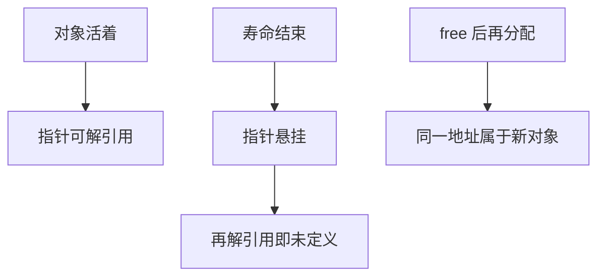

# 生命周期与悬挂

指针的值可以比它所指数的对象活得更长；对象一旦结束寿命，那份地址就不再指向任何对象。

<footer>—— 据 ISO/IEC 9899；Kernighan & Ritchie, The C Programming Language, 2nd ed.；Bryant and O'Hallaron, Computer Systems: A Programmer's Perspective 整理</footer>

上一课[整数溢出](/cs/integer-overflow)把有符号越界收进未定义行为。本课不重讲模算术，也不从垃圾回收另起。缺口是：指针课已经允许一个对象多个名字，栈课已经说明自动对象会消失——**名字还在、对象已死，这算什么**。悬挂是时间上的别名错误。

## 问题

对象寿命按存储期走：自动对象在块结束时亡，动态对象在 `free` 时亡，静态对象在进程结束时亡。指针是独立对象，存着一份地址值。当被指对象亡了，指针值成为不确定的（典型实现里仍是那串比特），再解引用就是 UB；有时连持有该值参与运算也不再安全。缺口因此不是「别忘了 `free`」，而是**寿命与指针值脱耦**。返回局部数组、`free` 之后继续用、把栈地址存进全局，都是同一缺口的实例。

与上一课的别名对照：别名是同一时刻两个名字指向活对象；悬挂是指针落后于寿命。`malloc`/`free` 配对错误还会造成泄漏（对象还活，名字丢了）——泄漏通常不是 UB，但会耗尽堆。本课重点在悬挂，泄漏只作为对照。

### 释放不是「把字节清零」

`free(p)` 结束动态对象的寿命，并不保证把那片字节写成 0，也不保证 `p` 变量被改成空。同一地址稍后可以再分配给别人，于是悬挂指针会在「看起来还能用」的数据上读写，造成跨对象破坏。把释放理解成擦除，会漏掉最危险的那种：程序继续跑，数据已属于另一个逻辑对象。

ISO C 用 lifetime 描述对象何时存在。K&R 警告不要返回局部地址。CSAPP 在堆与栈的图上把 use-after-free 画成时间错误。本课不把分配器空闲链表展开。

## 方法

规则直觉：指针解引用要求目标此刻活着，且类型匹配。函数返回自动对象的地址必然悬挂。动态对象必须有明确所有者：谁 `malloc` 谁 `free`，或把所有权写进接口文档。释放后立即把持有的指针置空，只能防止「同一变量再次误用」，不能修复已经拷贝出去的别名。

栈上「内层指向外层」在嵌套调用期间合法，因为外层还活着；返回之后外层也可能已经亡——要分清哪一层的寿命更长。结构体里的指针成员把寿命问题嵌进布局：拷贝结构体只拷贝地址，不延长被指对象的命。

`realloc` 可能返回新地址并使旧地址寿命结束，所有别名旧指针一起悬挂——这是堆上的集体死亡。接口若返回内部缓冲，必须写明下一次可能使其无效的调用（再 `read`、再 `realloc`）。C 库的 `strerror` 一类函数就有这种「下一次调用使上次指针无效」的契约。后课函数抽象要把这些句子写进头文件注释；只在实现里小心，调用方仍会存下野指针。

## 机制

悬挂之所以难查，是因为地址数值仍像合法指针，调试器里还能读到「旧内容」或新对象的内容。发行版里优化器按「不会解引用死对象」改写，症状可以远离真正的 `free` 点。这与未定义行为课的机制相同，对象换成了寿命。后课 [RAII](/cs/raii) 会把资源寿命绑到对象析构，本课先要求在 C 里用纪律模拟同一绑缚。

诊断上，ASan 把释放后的影子内存标脏，能抓住许多 use-after-free，但仍要求那条路径被执行。编译器也可以把悬挂解引用直接当成不可达而删掉后续代码，使测试「看起来没崩溃」。所以寿命必须写进函数契约，而不是靠一次 sanitizer 绿。栈上返回局部的 bug 在 `-O0` 里有时还能读到旧值，这是实现残留，不是寿命被延长。后课把「谁在边界上拥有对象」写成函数抽象，正是为了让销毁点唯一。

## 边界

本课不讲垃圾回收、不讲代际引用。下一课[函数作为抽象边界](/cs/fn-abstraction-boundary)开始把「谁拥有、谁释放」写成接口。后课默认：解引用只对活对象合法；返回局部地址、use-after-free 都是 UB；泄漏不是 UB 但破坏堆资源。

## 小结

- 指针值可长于对象寿命；死后解引用是未定义行为。
- `free` 结束寿命，不擦指针变量，地址可被新对象复用。
- 返回自动对象地址必然悬挂；所有权必须写进接口。
- 下一课把函数当成声明这些契约的边界。
- 出处：ISO C lifetime；K&R；CSAPP 堆与 use-after-free。
