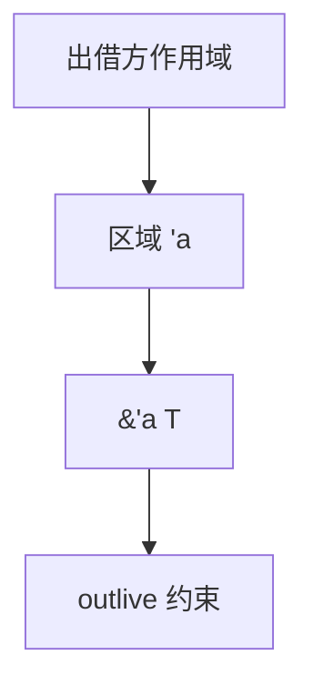

# 生命周期与区域

引用的类型带区域：`'a` 表示借用不得比出借方活得更长。区域推断把这些注解填进 HM 式的约束里。

<footer>—— 据 Tofte and Talpin, Region Inference, 1994；Grossman 等 Cyclone；Rust 生命周期阐述整理</footer>

上一课[借用检查](/cs/borrow-checker)在单函数活跃集上互斥。缺口是**跨函数**：返回局部的地址必须拒绝；结构体里存 `&'a T` 必须让 `'a` 不超过数据。区域 / 生命周期参数是类型里的名字，约束 `'a: 'b`（`'a` 活得至少和 `'b` 一样长）。本课钉区域，不重写线性拆分。

## 问题

STLC 没有「指针活多久」。C 靠程序员；GC 靠堆。区域推断（ML Kit）：值分配进区域，区域在确定点释放。Rust：不自动分区域堆，只跟踪借用的结束。缺口是**类型上的寿命**，不是 GC 算法。

推断：从 `&x` 产生新鲜 `'a`，从赋值与返回收集 outlive 约束，解不等式。失败则「lifetime mismatch」。

### `'static` 不是「泄漏」

`'static` 表示借用可活到程序结束（或拥有 `'static` 数据）。泄漏（`mem::forget`）是仿射的逃逸，与 `'static` 不同轴。

Tofte–Talpin 1994（区域）。Cyclone 的区域注解。Rust 把生命周期写成类型参数。Pierce TAPL 不覆盖 Rust；本课用区域文献+产品规则。本课不把效应系统当区域的别名，下一课才是效应。

## 方法

给引用类型加 `'a`。函数 `fn foo<'a>(&'a T) -> &'a U` 把输入寿命传到输出。子类型：更长的寿命可当更短用（协变于只读引用）。可变引用对寿命往往不变。

与[算法 W](/cs/hindley-milner-w)：生命周期是另一类变量，合一变成约束求解（不是对称类型等式的全部）。

## 机制

省略规则（lifetime elision）是语法糖，不是新语义。高阶：`for<'a>` 是区域上的通用量化。不要用 `'a` 当线程标识；发送与同步是另一些 trait。

区域推断失败时人加注解；与依值不同，区域通常擦除，运行时不留 `'a`。

## 边界

本课不写 Tofte–Talpin 的全部推断算法证明。后课默认：引用类型带区域约束。下一课效应系统：另一类「计算做了什么」的类型，可与区域组合。

也不把栈上的 C 局部地址当已有区域系统。

## 小结

- 生命周期/区域：借用不得超过出借方。
- 约束求解填 `'a`；运行时擦除。
- 只读引用对寿命协变；可变常不变。
- 出处：Tofte and Talpin, 1994；Cyclone；对照 Rust 规则。
