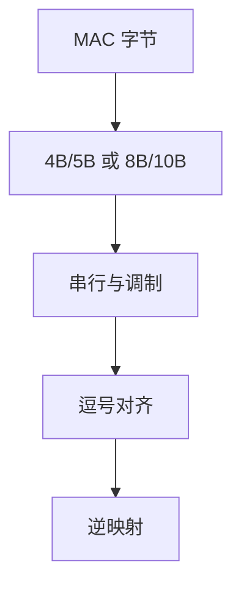

# 线路编码 4B/5B、8B/10B

线路码先换一组有足够跳变、直流近零的符号，再上调制；净荷比特率因此永远低于毛符号率。

<footer>—— 据 Widmer and Franaszek, 8B/10B, IBM J. R&D 1983；IEEE 802.3 100BASE-X / 1000BASE-X 整理</footer>

[上一课](/cs/modulation-symbol-rate)把比特率写成 $R_s\log_2 M$。长串 0/1 让基线漂移、时钟丢失。缺口是**线路编码**：4B/5B、8B/10B（以及后课扰码）用查表换冗余，换跳变与游程上界。本课不把 CDR 环路写完。

## 问题

NRZ 遇到五十个连续 1，接收机分不清边界。4B/5B（百兆光纤）：4 比特映 5 比特，禁止过长连 0。8B/10B：8 比特映 10 比特，控制 disparity 使直流平衡，并保留逗号符号做字对齐。开销 25% 或 20%，毛速率必须高于净荷——这是 $C$ 预算里先扣掉的一笔，不是 MAC 层的帧间隔。

以太网 64B/66B（10G 起）改用扰码加同步头，开销降到约 3%，对象仍是「可恢复的比特流」，机制下一课。

8B/10B 亦用于 Fibre Channel、PCI Express 早期代次。控制字符（K 码）不是用户数据。本课不把全部码表背完。

### 线路码不是压缩

映射公开且膨胀比特，目的是跳变与对齐。非法码字可在 PCS 早检，仍不替代帧 FCS。10G 以后的低开销块码把同一职责部分交给扰码。

## 方法

发送：MAC 字节 → 块编码 → 再 PAM/串行。接收：10 比特窗找逗号对齐，再逆映射。错误：非法码字可在 PCS 检出，早于 FCS。对照：FCS 管一帧；线路码管符号流的局部合法性。

方法止于选定对象与对照；机制才说它如何嵌入已有分层与主干课。

## 机制

主干[帧 CRC](/cs/frame-crc)假定已有比特边界。边界来自本课的跳变与逗号。交换机看到的是解码后的帧；PCS 错误可能在到达 MAC 之前就把链路标为 down。容量课的冗余在这里具体化为固定比例的块编码，不是随机码。

disparity：8B/10B 在两种 10 比特表示间切换，使游程与直流可约束。这是链路局部状态，不进入 IP。

## 边界

本课不引入 256B/257B 与 RS-FEC 的交织细节（25G+）。时钟恢复与扰码是下一课。后课默认：净荷速率 = 毛速率 × 块码率；逗号用于字同步。

线路码不是加密，也不是压缩：映射公开，且膨胀比特。

上一课留下的缺口在本课收口；「线路编码 4B/5B、8B/10B」进入后课词汇表后只引用。文献用来钉对象与边界，不把本课写成该主题的独立综述。下一课[时钟恢复与扰码](/cs/clock-recovery-scrambling)。

## 小结

- 4B/5B、8B/10B 用开销换跳变、直流平衡与对齐。
- 非法码字可在 PCS 早检；不替代 FCS。
- 净荷永远低于毛符号率。
- 后课只引用本课钉死的对象，不从该领域总问题重开。
- 出处：Widmer–Franaszek, 1983；IEEE 802.3。
