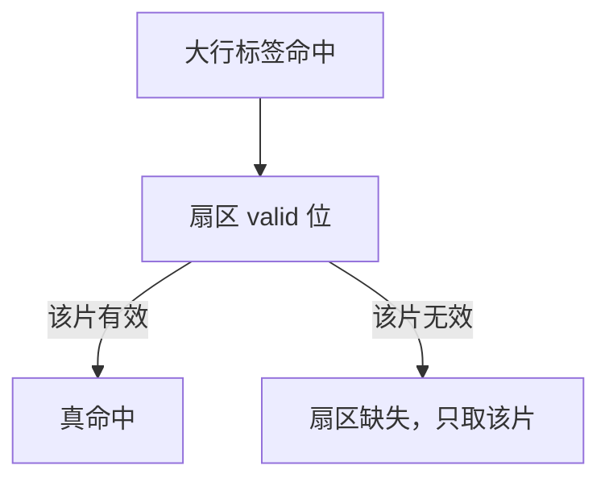

# 行大小与扇区缓存

行太短：强制缺失多、标签开销大；行太长：假共享与无用传输多。扇区让标签仍按大行走，有效数据可以只填其中几片。

<footer>—— 据 Hennessy and Patterson, CA:AQA 整理</footer>

[上一课](/cs/cache-compression) 在固定 64B 几何里挤信息。行大小本身是更早的旋钮：空间局部性希望大行，[假共享](/cs/false-sharing) 与带宽希望小行。本课不重做 BDI。缺口是**选行大小，以及扇区缓存：标签粒度与传输粒度分开。**

## 问题

32B 行：指针追逐可能刚好，顺序扫描要四倍缺失。128B 行：一次 miss 拉更多字节，预取器压力下降，但多核下两个变量同行的概率上升，一致性作废更频。缺口不是分区，而是**承认单一粒度难以两头讨好，用扇区在大标签块里只验证/只传输部分。**

扇区：例如 128B 逻辑行分成 4 个 32B，每片独立 valid。缺失可以只填被 touch 的扇区，其余稍后填或永不填。

## 方法

选行：对目标工作负载量空间局部性跨度与多核写密度。扇区：miss 时按扇区发总线事务；标签命中但扇区 invalid 算 sector miss，延迟类似短行 miss 但标签已在。写回可以只回脏扇区。

## 机制

强制缺失次数随行增大而降，传输字节与假共享上升。[预取](/cs/stride-stream-prefetch) 在大行上 $\Delta$ 以行为单位，过粗。压缩与扇区可组合：压缩后的槽仍对应逻辑行。目录项通常仍按全行，扇区是 data 路径优化。

指令 cache 往往用较大行：顺序取指的空间局部性极强，假共享几乎不存在。数据 cache 更纠结：指针结构要短行，数组扫描要长行，所以扇区主要出现在 D 侧与 LLC。

## 边界

本课不把 GPU 的 sector/cache line 配置当 CPU 的默认。也不提前把伪共享写完整课，只点名行越大越容易伪共享。写合并缓冲处理的是 store 的字节合并，粒度更细，下一课。

后课默认：传输不必整行；扇区把标签与数据粒度拆开。连续的窄 store 可以在进 cache 前先合并。

## 小结

- 行大小权衡强制缺失与假共享/带宽。
- 扇区缓存让一次标签覆盖多片，按需传输。
- 写合并在 store 路径上合并窄写，是下一课。
- 出处：Hennessy and Patterson, *CA:AQA*。
