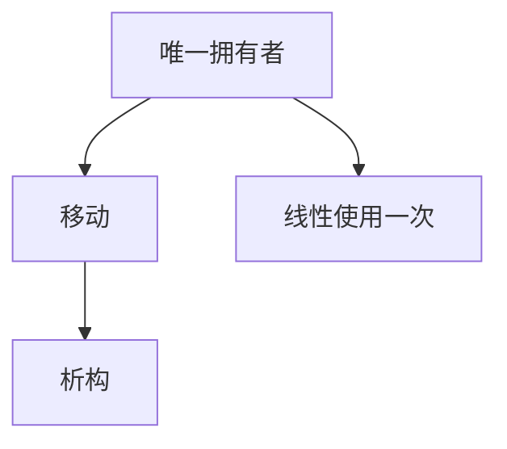

# 线性类型与所有权

线性假设：资源必须用恰好一次。所有权是把这条纪律编进类型，使别名与释放可静态拒绝，而不把每一次 `free` 交给程序员运气。

<footer>—— 据 Girard, Linear Logic, 1987；Wadler, Linear Types Can Change the World, 1990；Reynolds, Syntactic Control of Interference 整理</footer>

上一课[依值类型](/cs/dependent-types-intuition)让类型依赖值。缺口是另一轴：**用几次**。STLC 的变量可自由复制；文件句柄、堆块、互斥锁不行。线性类型：$\Gamma$ 在应用时拆分，不能把同一线性变量传两次。Rust 的所有权是这条纪律的工程化（移动语义、一次析构）。本课钉规则直觉，不写借用——下一课。

## 问题

HM 不管别名：两个 `ref` 可指同一单元，值限制只防多态。线性：项 $x$ 的类型若线性，则 $x$ 在体中恰好出现一次（或显式 `dup`/`drop` 能力）。缺口是**上下文拆分** $\Gamma=\Gamma_1+\Gamma_2$，不是 Π。

所有权：值有唯一拥有者，移动转移拥有者，作用域结束析构。这是线性（或仿射：至多用一次）在表面语言的说法。仿射允许忽略；线性不允许泄漏未用资源。

### 线性不是「引用计数等于 1」

RC 是运行时；线性是静态。RC 可循环；线性类型通常禁止未跟踪的别名。不要把 ARC 当线性类型的定义。

Girard 线性逻辑。Wadler 1990。Baker、Reynolds 对干扰控制。Rust 把仿射+借用做成产品。本课不把线性逻辑的全部联结词当作业。

## 方法

核心规则：变量从 Γ 取出即删除；λ 的参数线性则体用一次。`!A`（指数）恢复任意复制。实现：编译器做消耗检查，失败则「use of moved value」。析构插入在移动路径的汇合，与 SSA 的 φ 类似——后课 SSA 再对照插入点。

与[字典](/cs/typeclass-dictionary)：`Drop` 是析构的类型类；线性保证调用次数。

## 机制

闭包捕获线性值会消耗环境，故闭包本身线性。共享需要下一课的借用或显式 `Rc`。不要在线性语言里默许隐式复制大数组还声称有所有权。

C++ 移动是库约定加右值引用，类型系统不完整跟踪；对照用，不当成已解决。

## 边界

本课不写生命周期。后课默认：所有权/线性管唯一与析构。下一课借用检查：临时共享如何不破坏唯一。

也不把线性当 GC 的替代证明；GC 语言仍可加线性能力（Haskell 的线性类型扩展点名）。

## 小结

- 线性：上下文拆分，资源用一次；仿射允许丢弃。
- 所有权是移动+析构的表面纪律。
- 复制须显式能力，不是 HM 默认。
- 出处：Girard, 1987；Wadler, 1990；对照 Reynolds。
