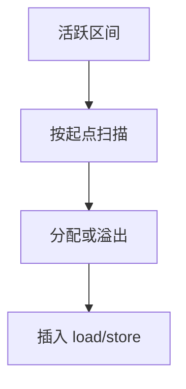

# 线性扫描寄存器分配

按活跃区间在线性序上扫描：遇起点分配，遇终点释放；冲突则溢出区间最短或最便宜的。一次扫描，适合 JIT。

<footer>—— 据 Poletto and Sarkar, Linear Scan Register Allocation, 1999；Wimmer and Mössenböck 的 SSA 线性扫描；对照 Chaitin 整理</footer>

上一课[fast-math](/cs/fast-math)收束中端契约。主干[寄存器着色](/cs/regalloc-color)已给冲突图。缺口是**更快的分配**：线性扫描用活跃区间（start,end），不建完整冲突图。后端单元第一课。本课钉扫描与溢出启发，精确着色下一课对照。

## 问题

着色质量好、JIT 里太慢。线性扫描：指令编号后，每个虚寄存器一个区间（SSA 上可拆成短区间）。维护当前活跃集合，大小超过 $K$ 则溢出。缺口是**区间近似**，不是图着色 NP 叙述。

SSA 线性扫描（Wimmer）：φ 与短区间提高精度，接近着色。

### 区间不是「源码作用域」

活跃性来自数据流，不是 C 的花括号。空洞（中间不活跃）可拆区间减冲突——裂变，后课拆分。

Poletto–Sarkar 1999。HotSpot/V8 用线性扫描家族。Appel 以着色为主。本课 JIT 动机明确，AOT 亦可。

## 方法

编号指令。算区间。按起点排序。扫描：释放已结束，分配空物理寄存器，否则选溢出。调用点：caller-save 区间要跨调用则保存或不用该类寄存器。

与[溢出](/cs/spill-remat)：重物化（remat）常数比溢出槽便宜，扫描时也可选。

## 机制

质量：长区间被溢出可能差于着色。调用密集时线性扫描仍要尊重 ABI。不要跨 `call` 把 caller-save 当免费。

与指令调度：先调度再分配或迭代；扫描假设已有序。

## 边界

本课不写 Chaitin 栈着色细节。后课默认：JIT 可用线性扫描。下一课 Chaitin–Briggs：图着色经典。

也不把线性扫描当磁盘调度。

## 小结

- 线性扫描：活跃区间 + 一次扫描分配。
- 快、适合 JIT；质量通常低于精细着色。
- SSA 短区间可改善。
- 出处：Poletto and Sarkar, 1999；Wimmer–Mössenböck；对照 Chaitin。
