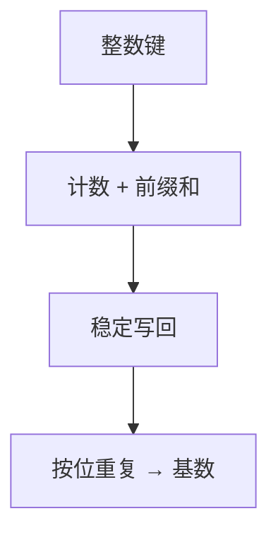

# 线性时间排序

当键是有界整数或固定长数字串，排序可以变成计数与按位分配，而不再问两两谁更大。

<footer>—— 据 Knuth, TAOCP vol. 3；CLRS 第 8 章整理</footer>

上一课[下界 Ω(n log n)](/cs/sort-lower-bound)把比较模型钉死。本课不重画决策树。缺口是：键若是 $\{0,\ldots,k\}$ 上的整数，或 $d$ 位 $r$ 进制数字，信息不必来自比较。本课只交出计数排序与基数排序，说明 $O(n)$ 何时合法。

## 问题

比较墙假设唯一的问题答案是「谁更小」。若键本身可当作数组下标，则一次扫描可以计入 $C[A[i]]$，前缀和给出秩，再稳定写回。代价 $\Theta(n+k)$。当 $k=O(n)$，这是线性。缺口不是推翻下界，而是**换模型**：算法读的是键的数值，不是比较谓词。

基数排序对每一位做稳定的计数（或桶），从低位到高位（LSD）。$d$ 位、每位点 $r$ 种，总时间 $\Theta(d(n+r))$。$d$ 为常数、$r=O(n)$ 时仍线性。

### 计数不是散列

散列把键打散到桶里但不保序；计数用键值当秩的原材料，前缀和是顺序。桶排序假设键来自均匀分布，期望线性，最坏仍可坏。本课主干是计数与 LSD 基数，不把桶排序的概率模型写完。

稳定是基数正确性的零件：低位排完后，高位相等的对必须保持低位次序。插入与归并可稳；堆排默认不稳，不能直接当基数的子过程。

## 方法

计数：开 $k+1$ 个计数器，扫 $A$ 填 $C$，前缀和，$A$ 从右往左写入 $B$（保证稳定）。基数：对 $j=1..d$ 用稳定计数按第 $j$ 位排。正确性：归纳为「最低 $j$ 位已有序」。

空间 $\Theta(n+k)$。与堆排就地对照：线性时间买的是值域数组。键为任意可比较对象时，退回比较排序。

## 机制

$k=\omega(n)$ 时计数不再线性，墙在比较模型外用空间说话。单词长 $w$ 的 RAM 上，整数排序可以更快，那是更细的模型，本课不启用。也不把浮点当整数：IEEE 位型要先映射成可比较的无符号，组成课已有浮点，本课不重做。

后课选择第 $k$ 小仍可在比较模型里线性；那是选，不是排完。本课的线性是**全排序**在受限键上。

## 边界

本课不声称「排序是 $O(n)$」。没有值域假设，比较下界仍在。也不处理外存多路归并：那是块 I/O，不是计数。字符串按字典序的 MSD 基数与递归桶是另一条实现，主干留在 LSD。

后课默认：比较排序 $\Omega(n\log n)$；整数或定长数字串可用计数/基数到 $\Theta(n+k)$ 或 $\Theta(d(n+r))$。

## 小结

- 离开比较模型后，计数给出 $\Theta(n+k)$，基数按位稳定重复。
- 稳定是基数的前提；堆排不能直接代入。
- $k$ 太大则线性消失。
- 出处：Knuth, TAOCP vol. 3；CLRS 第 8 章。
