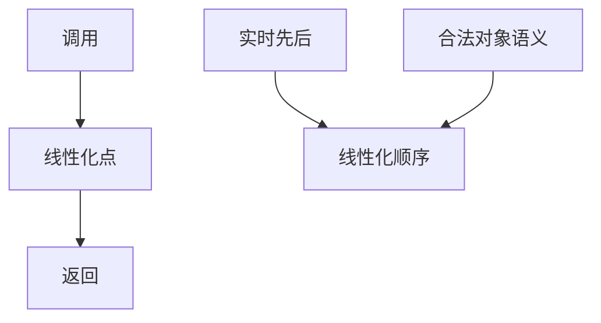

# 线性一致性

每次操作像在调用与返回之间的某个瞬间原子生效，且该顺序符合实时先后。客户端不必知道副本。

<footer>—— 据 Herlihy and Wing, Linearizability: A Correctness Condition for Concurrent Objects, TOPLAS 1990 整理</footer>

上一课[拜占庭将军](/cs/byzantine-generals)封上时间与失败课序。本单元不重写 $n>3f$。缺口是**对象看起来像什么**：多副本、多客户端时，「一次写」何时变成大家读到的值。本课钉线性一致（linearizability），后课再放松到顺序、因果、最终。后课默认已经读完：强一致首先指这个实时+原子点。

## 问题

并发对象有历史：调用与响应事件。线性一致：存在每个操作的线性化点，落在区间内，生效顺序是合法的单对象顺序，且实时不重叠的操作保持先后。比顺序一致强：顺序一致允许把整个历史重排，只要每客户端程序序还在，不必尊重跨客户端的实时。

缺口不是再讲锁，而是把「像单机原子变量」写成历史性质。寄存器的读写、队列的 enq/deq 都适用。分布式里：多数派读/写、主备切换后的读，都要问是否还能找到线性化点。

Herlihy–Wing 强调局部性：系统线性一致当且仅当每个对象各自线性一致。组合比顺序一致容易。

## 方法

证明或测试：给历史找线性化点，或用线性化点搜索（Jepsen/Knossos、Porcupine）。实现：单主串行化所有操作；或共识日志；或法定人数交叠。本课不写 Paxos 消息。

与[故障模型](/cs/failure-models)：崩溃恢复后若读到旧主未刷的值，线性化点就不存在——那是主备课的缺口。本课只给尺子。

## 机制

线性一致禁止「读到未来」也禁止「实时上更晚的读读到更旧的值」（在中间没有写的情况下）。stale read、从从库读，默认不是线性一致，除非从库的 apply 位置被读请求等到。时钟：线性化点是逻辑上的，不必是 NTP 瞬间；TrueTime 用 $\varepsilon$ 把点钉在墙钟区间里，那是后课。

本课不把线性一致与可串行混名：可串行是事务调度，线性一致是单个对象（或已声明为对象的组合）的实时原子。事务隔离课已经用冲突图；这里对象是寄存器、锁、配置。

局部性让你分开证锁服务与文件服务。顺序一致没有局部性，组合会破。

## 边界

本课不定义会话保证，不写 CAP。不把「强一致」广告词当定理。后课默认：要实时+原子，就线性一致；只要每客户端程序序，是顺序一致；只要因果，是下一课的另一档。拜占庭下线性一致仍有定义，实现更贵。

尺子先于协议。后面每一种复制都要回答：它保这把尺子的哪一段。

## 小结

- 线性化点落在调用–返回之间，且尊重实时先后。
- 局部性：逐对象证即可组合。
- 从库读、缓存、异步复制默认不是线性一致。
- 出处：Herlihy and Wing, TOPLAS 1990。
