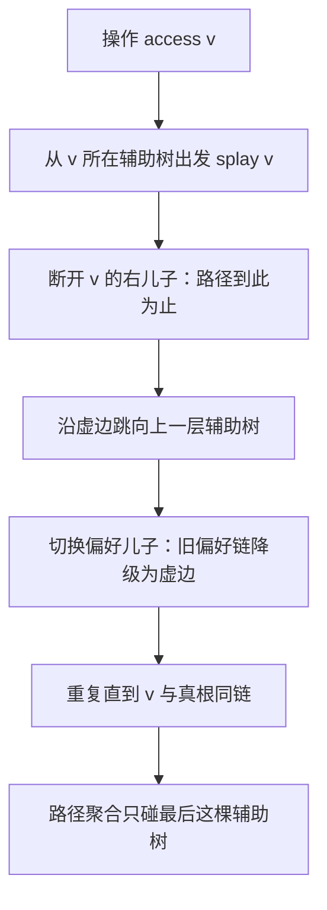
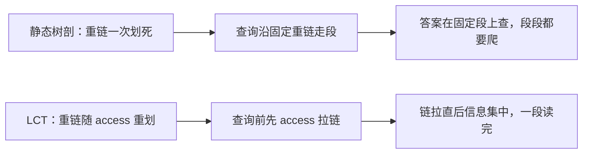

# 动态树与 LCT

树一旦允许 link 与 cut，任何一次排好的 DFS 序都会作废；LCT 用偏好路径把「结构在变」摊还进每次访问，单操作摊还 $O(\log n)$。

<footer>—— 据 Sleator 与 Tarjan, A Data Structure for Dynamic Trees, 1983</footer>

[算法工程案例与收束](/cs/ae-case-map)把整条算法主线收进了案例——案例里的结构都是静态的。算法里常碰到的树却不冻结：[tree-binary-lifting](/cs/tree-binary-lifting) 的倍增表、树剖的重链划分，都默认树不再长枝。缺口是 **动态树**：边会连、会断，路径聚合还得照答。本课写 LCT——不是把静态剖分搬来重跑，而是换一套随时重划的链。

## 问题

静态树上路径求和走树剖加 [segment-tree](/cs/segment-tree)，LCA 走倍增；一次 cut 让子树归属全变，DFS 序整段报废，重建一遍是 $O(n)$，混进 $10^5$ 次增删就是灾难。缺口：支持 link（连边）、cut（断边）、换根、路径查询修改的结构。本课不写 splay 摊还证明的全推导，也不展开子树聚合的虚儿子维护——那是软肋，下一课补。

术语翻译：preferred path 译作「偏好路径」，preferred child 译作「偏好儿子」；LCT 实为一个「辅助树森林」——真树不动，动的只是每条偏好链在 splay 树里的挂法。辅助树之间由虚边相连，虚边指向本链挂靠的上一层点。

数字实例：$10^5$ 次混有 link/cut 的操作，朴素方案每次重建序要 $O(n)$，合计 $10^{10}$ 级别；LCT 摊还 $O(\log n)$，合计约 $10^5\times 17$，差了三个数量级。

## 方法

核心操作只有一个 **access**：把 $v$ 到真根的路径拉成一条偏好路径，路径信息随之集中进一棵辅助树。makeroot（换根，翻转路径的懒标记）、link、cut 全是 access 的组合：cut 先 makeroot 再 access 再断链，link 先 makeroot 一端再挂到另一端。

七步里只有 splay 与断右儿子真正改树形，其余是标记与指针搬动。写实现先把 access 打磨对，再往上叠 makeroot 与 link/cut，顺序反了会 debug 到怀疑人生。

直觉类比：偏好路径像公交公司每天重新划的快车专线——街道（真树）没变，只是「今天这条路上走快线」的标记在变。access 就是重新划线：要去的路线涂成专线，别的线降级。划线的成本被均摊进每次乘车。

## 机制

为什么摊还 $O(\log n)$：splay 自身的摊还界管住辅助树内部；access 中切换偏好儿子的次数另有硬上限——每次被降级的原偏好儿子按重轻边性质必连一条轻边，而任意点到根的轻边不超过 $O(\log n)$ 条。两个对数界相加，总摊还仍是对数。偏好儿子是给辅助树森林的标记，真树上没有「链」这层概念，换根、翻转才不至于改乱真实结构。

常见误区：以为 access 会把整棵真树压成一条链。真树一个字节没动，变的只有偏好标记与辅助树形态；错在把「辅助树里的链」读成「真树的链」，于是写出「access 后 $v$ 是全树根」这类断言——$v$ 只是偏好路径的底端。

对照读：树剖赢在常数与实现简单，LCT 赢在链可以随时重划。同一道题能静态做就别上 LCT。

## 边界

LCT 主场是路径聚合、连通性维护、动态最小生成树（边权变更时按权试连试断）。子树和、子树最值要给每个点额外记「虚儿子信息之和」，换根时增量更新，实现难度跳一档——这恰是下一课欧拉序的主场，那边子树信息顺手、路径信息变难，两种结构互为镜像。

常见误区：在纯静态题上用 LCT 交卷——能过，但常数是树剖的数倍，还多养一套翻转标记。选型判据一句话：结构会不会变；会变才轮到 LCT。

## 小结

- access 把 $v$ 到根拉成偏好路径，makeroot/link/cut 全是它的组合。
- 摊还 $O(\log n)$ 来自 splay 摊还界加重轻边性质双重夹逼。
- 真树不变，变的只有偏好标记——想通这点，翻转与换根才写不错。
- 子树聚合是软肋，下一课的欧拉序补那一面。
- 出处：Sleator 与 Tarjan, *A Data Structure for Dynamic Trees*, JCSS 1983；splay 摊还分析见同作者 *Self-Adjusting Binary Search Trees*, 1985。
