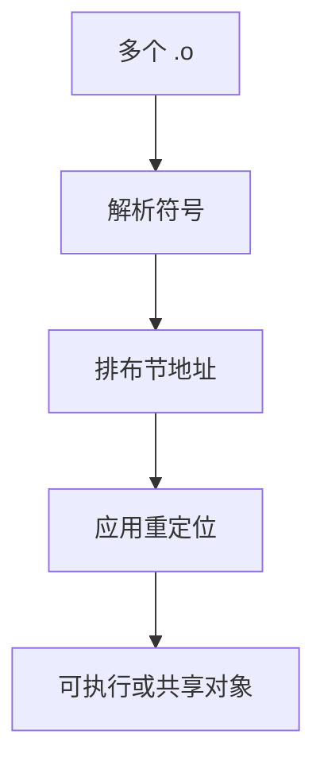

# 链接与重定位

汇编留下对符号的空洞；链接器把多个可重定位目标拼成一份地址空间，并按重定位项把空洞填成真正的位移或绝对地址。

<footer>—— 据龙书第 7 章；System V ABI 与 ELF 规范整理</footer>

上一课[位置无关代码](/cs/pic)发出遵守调用约定的指令，其中 `call foo` 的目标往往还不是最终地址。本课不重写序言。缺口是：**多份目标文件**如何合成一个程序——符号解析与重定位。动态加载下一课才把运行时绑进来。

## 问题

编译器按编译单元工作，不知道 `printf` 的最终虚址。目标文件提供：代码/数据节、符号表（定义与未定义引用）、重定位列表（偏移、类型、符号）。静态链接：解析未定义到某份 `.o` 或 `.a` 的定义，排布节，应用重定位。失败：未定义引用或重复定义。

[存储程序](/cs/stored-program)已说指令在内存；本课问地址何时钉死。可执行文件有入口点；共享库的地址可推迟。

### 重定位不是「再编译」

链接器不读源，不跑类型检查。它读节与记录。PC 相对跳转填的是差；绝对地址填的是虚址。ISA 立即数宽度不够则链接失败或要存根，选择课已碰立即数，这里是链接期诊断。

ELF 的 `R_X86_64_*` / `R_RISCV_*` 类型在 psABI 里。本课不枚举。Unix 链接器与 `ld` 的脚本控制节序，点名即可。

## 方法

读入 `.o`。合并同类节。解析符号：强符号冲突报错，弱符号规则按文档。按重定位项：`S+A-P` 等公式写入指定字节。输出可执行或可再重定位的 `.so` 雏形。

静态库是按需抽取的 `.o` 包，解析时拉入。

## 机制

ABI 的调用约定保证拉进来的 `foo` 能用当前的参数寄存器。链接不管类型：C 的弱类型可链上签名错误的定义，那是语言/链接器分工，类型课的检查过不了别的文件除非 LTO。本课点名：常规链接信任符号名。

## 边界

本课不写 `mmap` 加载、不写 PLT/GOT 的运行时跳板（下一课）。不处理内核模块特殊重定位。后课默认：静态链接产物地址已填好。动态链接把部分重定位推迟到加载或第一次调用。

## 小结

- 链接 = 符号解析 + 节排布 + 重定位填写。
- 编译单元各自的空洞在此闭合。
- 不读源；类型错误可以漏到运行时若逃过前端。
- 出处：Aho et al., 龙书第 7 章；ELF 与 System V/RISC-V psABI。
