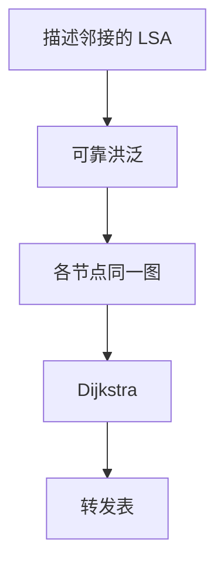

# 链路状态

每台路由器描述自己的邻接，洪泛全网；每台用同一张图跑最短路，得到下一跳。

<footer>—— 据 Dijkstra 最短路；Moy, RFC 2328 OSPF Version 2 整理</footer>

[上一课](/cs/count-to-infinity)只交换摘要距离，坏消息慢。缺口是**链路状态**：通告「我连着谁、代价多少」，各节点独立计算。图课的 [Dijkstra](/cs/dijkstra) 已会单源最短路；本课把它接到 OSPF 式的洪泛与区域直觉，不把 LSA 类型表背完。

## 问题

DV 看不到边，无法可靠地区分「真断」与「邻居还在用我」。链路状态：邻接建立后，产生本节点的状态，可靠洪泛（确认、序号），每节点得同一有向图（理想情况），再 Dijkstra 出转发表。缺口不是 LPM 规则，而是这套「复制图 + 本地计算」。

本课不把 IS-IS TLV 与 OSPF 逐字段对照。

洪泛要可靠且防环：序号与老化。分区用区域把图缩小，边界仍摘要，这是规模，不是另一算法。

## 方法

Hello 发现邻居；邻接同步数据库；边变化则新版本 LSA 洪泛；SPF 计算：对每个前缀取最短路径的第一跳，写入 [LPM](/cs/lpm)。代价通常是管理配置的正数，不是时延测量本身。与生成树不同：链路状态允许用所有边转发（按前缀下一跳），不必阻塞成树。

## 机制

收敛：坏边的 LSA 一到，所有人重算，不再靠互相引用旧距离。代价是内存与洪泛带宽、SPF 的 CPU。端到端仍不保证：SPF 期间可暂环，TTL 兜底。与 DV 对照：信息是边不是距离，计算在本地而不是嵌在通告里。

域内用 LS 或改进的 DV；域间政策不能用纯最短路——下一课 BGP。

## 边界

本课不引入流量工程扩展（RSVP-TE）当主干必学。不把 OSPF 与 BGP 的行政距离写成厂商手册。多区域摘要会导致区域内次优，点名即可。地址族 v4/v6 共用同一思想。

分区计算：区域内 SPF，区域间走摘要。摘要错误会造成黑洞，这是配置问题不是 Dijkstra 失败。

后课默认：域内可以有一张共享图。自治系统之间按政策选路，下一课 BGP 直觉。

## 小结

- 链路状态：洪泛邻接，本地 Dijkstra，填 LPM。
- 比 DV 看见边，收敛通常更快。
- 跨 AS 的政策不是最短路，下一课。
- 出处：Dijkstra；RFC 2328；Kurose and Ross。
