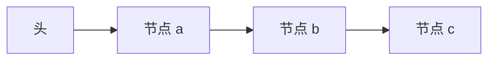

# 链表与局部性代价

指针把插入从搬移改成改两三条边；下一次访问的地址不再是加一个常量，cache 与预取都失去对象。

<footer>—— 据 Cormen, Leiserson, Rivest and Stein, Introduction to Algorithms；Hennessy and Patterson 存储器层次 整理</footer>

[上一课](/cs/dynamic-array)把按下标读做成 $\Theta(1)$，中间插入要搬 $n$ 个元素。[局部性原理](/cs/locality-principle)依赖「下一块地址可预测」。本课不重讲基址加偏移。缺口是另一种表示：节点散落在堆上，用指针串成序列，从而在已知节点处插入删除 $\Theta(1)$ 步，并显式付出随机访问与空间局部性。

## 问题

数组合同里没有「在这个元素后面塞一个」的廉价操作。把元素做成节点 `{值, 后继}`，插入不再搬移。缺口不是再定义序列 ADT，而是承认：**步数上的 $O(1)$ 插入，用的是打散的地址**，与 cache 行、预取、NUMA 本地都作对。

单向链表找不到前驱；双向用再一个指针换。本课以单向为主，点名双向。不引入跳表的多层指针。

指针追逐是 cache 缺失分类里接近必现的容量/强制混合：工作集是节点集合，空间局部性近乎零。

## 方法

节点动态分配。头指针代表表。在已知节点 $p$ 后插入：$q.\mathrm{next}=p.\mathrm{next},\ p.\mathrm{next}=q$，常数次 store。按下标找第 $i$ 个必须走 $i$ 步，合同变成 $\Theta(i)$，不再是数组的 $\Theta(1)$。

顺序遍历的渐近仍 $\Theta(n)$，但每步可能 miss 一次 DRAM，常数比数组扫大一个层次存储器倍数。ADT 课开始时说的「代价含常数」在这里具体化。

## 机制

链表适合中间频繁插入、几乎不按下标跳的工作负载。栈和队列可以用链表实现，也可以用数组；后课按操作选。[调用约定与栈](/cs/calling-convention-stack)的硬件栈是连续数组，不是堆上链表——那是因为调用需要空间局部性与地址计算。

释放节点必须避免悬挂：删掉的后继要从链上摘下。这是表示不变式，不是 ISA 异常。头插与尾插改变的是哪根指针，合同仍是序列，只是端点不同。

## 边界

本课不把链表写成「动态数组的替代品」：随机访问需求仍该用数组。也不引入 XOR 链表等压缩技巧。并行下无锁链表是附录。

后课默认：序列有两种主表示。栈作为 ADT，限制只在一端操作，表示可以是数组顶或链表头。

## 小结

- 已知位置插入删除 $\Theta(1)$ 步；按下标访问 $\Theta(i)$。
- 地址无步长，空间局部性差，cache 常数大。
- 栈把序列合同收窄到一端，下一课只谈那一端。
- 需要随机访问时仍用数组，不要把链表当动态表的替代品。
- 出处：Cormen et al. 链表；与 *CA:AQA* 局部性对照。
