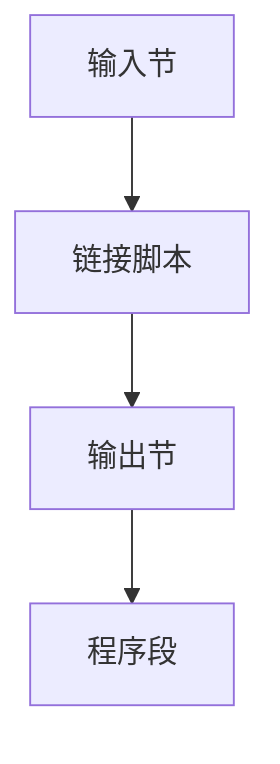

# 链接脚本与段

链接脚本描述输出段如何从输入节拼起来、地址多少、对齐多少。嵌入式与内核靠它，而不是靠默认的用户态布局。

<footer>—— 据 GNU ld 链接脚本文档；ELF 节与段；Levine 整理</footer>

上一课[符号解析](/cs/linker-symbol-resolution) 知道哪些 `.o` 进来。缺口是**放到哪**：`.text`/`.data`/`.bss` 合成哪些 PT_LOAD。链接脚本：`SECTIONS { .text : { *(.text*) } }`。本课钉节 vs 段，不写 ELF 文件头全文——后课格式。

## 问题

编译器吐节（section）；加载器看段（segment）。脚本控制合并、空洞、`VMA`/`LMA`（ROM 运行拷到 RAM）。缺口是**布局语言**，不是归档抽取。

默认脚本服务 SysV 用户态。内核、MCU、引导程序必须自定义：向量表在 0，栈顶符号等。

### 节不是段

节给链接与调试；段给 `mmap`。一个段可含多个节。混淆则「为什么 .text 在文件偏移 X」讲不清。

GNU ld scripts。ELF `shdr`/`phdr`。本课嵌入式动机明确。不进限价簿。

## 方法

写脚本：入口 `ENTRY`、内存区 `MEMORY`、节输出。丢弃 `.comment`。提供符号 `_end`。与 `--gc-sections`：未引用节可丢，脚本仍要保留入口与向量。

与 LTO：优化后节名仍要匹配通配符 `*(.text.*)`。

## 机制

对齐：缓存行、页。错误脚本使指针差非法或加载失败。不要把脚本当 C 预处理器。

Overlays：同一 RAM 不同时刻不同映像，脚本支持，点名。

## 边界

本课不写动态重定位类型。后课默认：布局由脚本或默认 ABI 布局决定。下一课静态对动态链接。

也不把脚本当 shell 脚本课。

## 小结

- 链接脚本：输入节 → 输出节/地址。
- 节服务链接，段服务加载。
- 内核与 MCU 必须自定义布局。
- 出处：GNU ld 文档；ELF；Levine。
