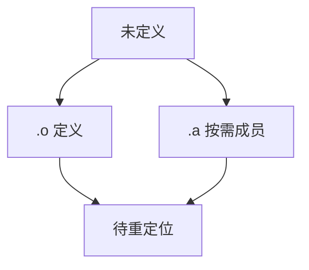

# 链接器符号解析与归档

未定义引用在输入 `.o` 与归档成员中查找定义。静态库是按需抽取的目标文件包：只有被引用的成员才拉进来。

<footer>—— 据 System V ABI；Levine, Linkers and Loaders；龙书第 7 章；主干[链接与重定位](/cs/link-reloc) 整理</footer>

上一课[符号与 mangling](/cs/name-mangling) 给出扁平名字。主干链接课已有重定位直觉。缺口是**解析算法与 `.a` 归档**：扫描次序、弱符号、重复定义。本课钉静态解析，动态下一课之后。链接课序从这里开始。

## 问题

链接器维护已定义集合与未定义集合。读入 `.o`：定义满足未定义，新未定义加入。归档：只当当前未定义命中某成员才抽取该成员，可能再引入新未定义，循环直到稳。缺口是**这份工作表**，不是 mangling 规则。

次序：传统 Unix 从左到右，`--start-group` 解循环依赖。重复强符号报错；弱被强覆盖。

### 归档不是「把目录打成 zip 就执行」

`.a` 不是可执行。成员是 `.o`。ranlib 符号表加速查找。不要和 `.so` 混。

Levine 的 Linkers and Loaders。GNU ld。主干 link-reloc 课。本课补归档与解析策略。

## 方法

命令行顺序读入。对每个符号：绑定 GLOBAL/WEAK/LOCAL。LTO 位码对象当 IR 包，解析后进优化——[LTO](/cs/lto)。

与可见性：`hidden` 不进动态符号表，但仍参与静态解析。

## 机制

循环依赖库要用组或合并 `.o`。不要靠运气次序。C++ 静态构造的拉入：归档可能丢掉只含构造函数的成员，需 `--whole-archive` 或显式引用。

弱符号服务内联与模板的 COMDAT，下一课 ICF 再折同码。

## 边界

本课不写动态 `DT_NEEDED`。后课默认：静态解析按序+归档抽取。下一课链接脚本与段。

也不把解析当 DNS。

## 小结

- 解析：未定义到定义；归档按需抽成员。
- 强弱、次序、循环组是工程规则。
- 与 LTO 对象同一符号模型。
- 出处：Levine；System V ABI；Aho et al. 龙书。
