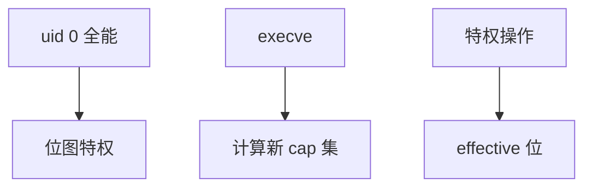

# Linux capabilities

capabilities 把 root 切成可单独授予的位：绑定低端口、加载模块、改时钟各占一位，进程不必再拿完整 uid 0。

<footer>—— 据 POSIX 1003.1e 草案直觉；Linux capabilities(7)；[内核加固](/cs/kernel-hardening) 为利用缓解对照</footer>

[上一课](/cs/timer-wheel)收口调度。[用户/内核](/cs/kernel-user) 用 uid。缺口是 **把超级用户拆成位图**：bounding set、ambient、file capabilities。

## 问题

传统：uid 0 全能。cap：`CAP_NET_BIND_SERVICE` 即可 `:80`。缺口：effective/permitted/inheritable 三集合；execve 如何算新集；`CAP_SYS_ADMIN` 仍过大。本课不把每一位 man 页抄完。

文件能力：给二进制标 cap，不必 suid root。容器常 drop 再加回少数位。

## 方法

内核在特权检查处查 `capable()`。对照 LSM：cap 是粗粒度特权，LSM 是强制访问。对照 [seccomp]：seccomp 滤系统调用，cap 滤特权操作。对照 [dm-crypt](/cs/dm-crypt)：解锁盘可能要 cap 或 uid。

## 机制

capabilities 缩小攻击面：被攻破的守护不必带完整 root。残留的 `SYS_ADMIN` 说明拆分不彻底。不要写成云 IAM。与 [userfaultfd](/cs/userfaultfd)：操作别人地址空间另要 ptrace 等，不单是 cap。

调试：`getpcaps`、`/proc/self/status` 的 Cap 行。

实现上：bounding set 限制能获得的 cap，容器常用它做不可再加。ambient 让非 root 执行文件后仍留住某些 cap。CAP_SYS_ADMIN 几乎等于旧 root，拆分失败就在这里。 读法上只引用[上一课](/cs/timer-wheel)的结论，不把对象换成训练推理或限价簿。

本课在操作系统进阶的「安全、启动与调试 / 内核安全与启动」课序里，对象是 **Linux capabilities**。

- 先修只引用，不重导：上一课的结论当公理，本课只补差。
- 五栏不吞并：不把本课写成大模型训练/推理，也不写成限价簿或权重量化。
- 文献用 OSTEP、McKusick、内核文档与具名会议论文；不发明 arXiv 编号。

## 边界

本课不引入命名空间里 cap 的全部映射。不保证 Android 的额外位。下一课强制访问：LSM 与 SELinux。

版本字段会变，课序钉的是机制对象「Linux capabilities」，不是某一主线内核的结构体名。
后课默认：特权是位，不是单一 root。LSM 钩子与 SELinux 标签，下一课。

## 小结

- capabilities 把 root 拆成可丢弃的位。
- exec 与文件 cap 决定子进程特权。
- LSM/SELinux 是下一课。
- 出处：Linux `capabilities(7)`；POSIX 草案；内核 security。
